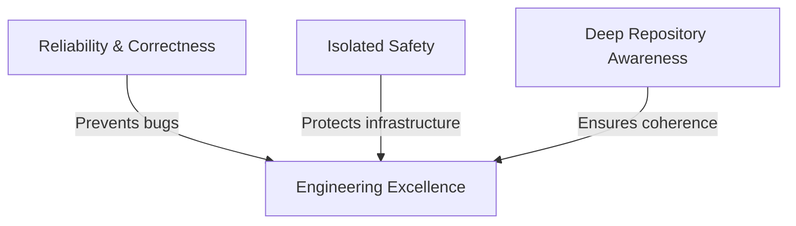

# CodeOrbit AI Constitution

> **Status:** Proposed for Approval  
> **Version:** 1.0.0  
> **Effective Date:** July 11, 2026  
> **Scope:** Core Architecture, Engineering Philosophy, and Development Guardrails

---

## 1. Mission

CodeOrbit AI is an **Autonomous AI Software Engineering Platform** whose purpose is to transform natural language instructions into production-ready software through intelligent planning, deep repository understanding, architecture design, safe implementation, systematic validation, comprehensive testing, and seamless human approval.

---

## 2. Vision

To become the world's most reliable, secure, and maintainable autonomous software engineering platform, enabling developers and organizations to build, refactor, and maintain production systems with AI as a trusted, highly capable peer. 

Every architectural decision and implementation choice must move CodeOrbit AI closer to competing with and exceeding world-class AI engineering platforms such as **Cursor, Claude Code, GitHub Copilot, and Devin**. We achieve this by optimizing for reliability, maintainability, extensibility, safety, repository awareness, and real customer workflows rather than optimizing for a high feature count.

---

## 3. Long-Term Goal

Build a fully autonomous software engineering loop capable of:
1. **Navigating Massive Codebases:** Mapping repository structures, understanding complex dependencies, and resolving symbols automatically.
2. **Architectural Coherence:** Designing changes that respect established patterns, coding guidelines, and performance standards.
3. **Multi-File Refactoring:** Safely modifying multiple components across a repository in a single unified planning and execution cycle.
4. **Autonomous Quality Assurance:** Writing comprehensive test suites (unit, integration, regression), executing them, and auto-remediating issues when test execution fails.
5. **Lint-Clean Output:** Delivering final codebases that are fully type-safe, lint-compliant, and ready for production deployment without human cleanup.
6. **Human-in-the-Loop Integration:** Seamlessly presenting proposed changes with descriptive, human-readable rationales, clear diffs, and verification reports.

---

## 4. Engineering Philosophy

We reject feature bloat and short-lived demos. Instead, our engineering philosophy is built on three core pillars:

* **Quality & Stability over Speed:** We prioritize robust error handling, transactional safety, and deterministic validation over adding unverified features.
* **Isolated Safety:** Autonomous execution must never compromise user or host safety. Code execution must occur within strictly bounded sandboxes with explicit import blocklists, system call monitoring, and resource constraints.
* **Maintainability & Extensibility:** Code must be highly structured, modular, and self-documenting. If a component cannot be easily extended with new agent types or developer tools, its design is incomplete.
* **Human-in-the-Loop (HITL) Respect:** The user is the ultimate authority. Our systems must present structured decision points, detailed execution traces, and safe rolls-backs.

---

## 5. Core Principles

To guide all future implementations and design patterns, we adhere to the following principles:

| Principle | Description | Implementation Strategy |
|---|---|---|
| **Repository-Awareness** | Every change must respect existing imports, patterns, and conventions. | Automated repository indexing, symbol mapping, and configuration parsing. |
| **Deterministic Verification** | Validate code behavior through execution, not just LLM output predictions. | Compulsory test suites, static analysis checks, and AST parsing. |
| **Transactional Memory** | Agent execution states must be persistent, transactional, and serializable. | SQLite database running in WAL mode with transactional session management. |
| **Observability & Traceability** | Every planner decision and agent step must leave a detailed trace. | Automated structured logging, execution metrics, and step-by-step console visualization. |
| **Fail-Safe Design** | Operations must degrade gracefully and support automated recovery. | Task state recovery on startup, retry queues with exponential backoff, and state rollback mechanisms. |

---

## 6. AI Agent Responsibilities

The platform divides execution among specialized, highly-cohesive agents:

* **Planner Agent:** 
  * Decomposes user requests into structured, execution steps.
  * Validates the execution plan as a Directed Acyclic Graph (DAG) for cycles, circular references, and missing dependencies.
* **Researcher Agent:** 
  * Explores the codebase, searches logs/metrics, and reads documentation.
  * *Must not make code changes.* Acts as a read-only context gatherer.
* **Developer Agent:** 
  * Implements precise code modifications.
  * Focuses on minimal, clean edits, adhering strictly to imports, style sheets, and formatting.
* **Reviewer Agent:** 
  * Evaluates code changes using static analysis, linting tools, and testing suites.
  * Generates feedback and requests remediation if standards are not met.
* **Workflow Orchestrator:** 
  * Manages the lifecycle of agent execution, task queueing, state persistence, and worker heartbeats.

---

## 7. Architecture Direction

To scale and compete, the codebase will adhere to the following structural guidelines:

1. **Decoupled System Boundaries:** Keep the web interface (Next.js), the API gateway (FastAPI), the queue database (SQLite WAL), and the runtime executor completely isolated.
2. **Thread-Safe Memory Management:** Share memory across worker threads via transactional records in the database, avoiding in-memory global state sharing which causes race conditions.
3. **AST-Hardened Sandboxing:** Execute user-submitted and agent-generated scripts strictly within isolated execution blocks, parsing the AST to block unauthorized library imports (`os`, `sys`, `subprocess`, etc.) and system calls.
4. **Dynamic Autodiscovery:** Register agents dynamically through decorators, ensuring the registry remains extensible without hardcoding class imports.

---

## 8. Development Rules

> [!IMPORTANT]
> The following rules are binding for all development, refactoring, and additions to this repository.

1. **No Code Without Planning:** Every significant code change must be preceded by an architectural alignment check or a formal plan.
2. **Maintain Documentation Integrity:** Preserve all existing comments, docstrings, and documentation unless deprecating or explicitly refactoring the associated components.
3. **Zero Lint Errors:** All new and modified code must be formatted and lint-compliant (e.g., using `ruff` and type-checking).
4. **Zero Regressions:** Any code change must be accompanied by relevant unit or integration tests, and the existing test suites must pass without error.
5. **No Sandbox Bypasses:** Do not create backdoors, dynamic `eval` utilities, or loose permission overrides that bypass AST sandboxing.

---

## 9. Definition of Done (DoD)

A task is considered **Done** only when it satisfies all the following criteria:

* [ ] **Compilation & Linting:** Code is lint-clean, type-safe, and passes all static analysis rules.
* [ ] **Testing:** All existing tests pass, and new tests are written to cover edge cases, error conditions, and core workflows.
* [ ] **Code Quality:** The code contains no duplicate implementations, no commented-out code blocks, and retains all unrelated docstrings.
* [ ] **Documentation:** System documentation, README, and API specs are updated to reflect the new state.
* [ ] **Human Review:** The changes are presented clearly with a diff, a justification, and a test report for approval.

---

## 10. Non-Goals

We will *not* spend resources on:
* Building proprietary large language models; we rely on, adapt, and build guardrails around state-of-the-art models (e.g., Gemini).
* Creating ad-hoc user interface features that do not directly help developers plan, build, test, and approve code.
* Building wrappers for tools that are better suited for client-side IDE integrations rather than server-side agent execution.
* Optimizing execution speeds at the expense of safety, validation correctness, or repository stability.
