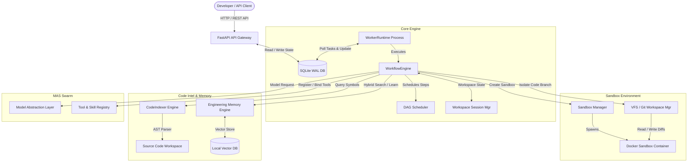

# CodeOrbit AI

<!-- PROJECT LOGO PLACEHOLDER -->
<p align="center">
  
</p>

<p align="center">
  <strong>Production-oriented, security-hardened multi-agent AI orchestration platform for autonomous software engineering.</strong>
</p>

<p align="center">
  <a href="https://github.com/faizanshah7424/multi-agent-system/actions"></a>
  <a href="https://codecov.io/gh/faizanshah7424/multi-agent-system"></a>
  <a href="file:///E:/multi-agent-system/LICENSE"></a>
  <a href="https://img.shields.io/badge/Python-3.11%2B-blue?style=flat-square&logo=python"></a>
  <a href="https://img.shields.io/badge/FastAPI-0.100%2B-009688?style=flat-square&logo=fastapi"></a>
  <a href="https://img.shields.io/badge/Next.js-15-000000?style=flat-square&logo=nextdotjs"></a>
  <a href="https://img.shields.io/badge/TypeScript-5-3178C6?style=flat-square&logo=typescript"></a>
  <a href="https://img.shields.io/badge/Docker-Supported-2496ED?style=flat-square&logo=docker"></a>
  <a href="https://img.shields.io/badge/Status-Beta-orange?style=flat-square"></a>
</p>

---

## 📖 Table of Contents

1. [Vision](#-vision)
2. [Why CodeOrbit AI?](#-why-codeorbit-ai)
3. [Key Capabilities](#-key-capabilities)
4. [Feature Comparison](#-feature-comparison)
5. [Architecture](#-architecture)
6. [Tech Stack](#-tech-stack)
7. [Screenshots](#-screenshots)
8. [Installation](#-installation)
9. [Quick Start](#-quick-start)
10. [CLI Commands](#-cli-commands)
11. [Dashboard](#-dashboard)
12. [Project Structure](#-project-structure)
13. [Example Workflow](#-example-workflow)
14. [Engineering Memory Engine](#-engineering-memory-engine)
15. [Multi-Agent System Swarm Dynamics](#-multi-agent-system-swarm-dynamics)
16. [Sandbox Isolation](#-sandbox-isolation)
17. [Security Hardening](#-security-hardening)
18. [Benchmarks](#-benchmarks)
19. [Roadmap](#-roadmap)
20. [Documentation Index](#-documentation-index)
21. [Contributing](#-contributing)
22. [License](#-license)
23. [FAQ](#-faq)

---

## 🌟 Vision

CodeOrbit AI is an autonomous, repository-aware software engineering platform designed to automate complex, multi-step development workflows. Rather than relying on simple linear prompts or raw script execution, CodeOrbit AI acts as a collaborative swarm of specialized agents that analyze codebases, generate execution DAGs, write and review code, run test-driven validation, and apply self-healing logic inside isolated environments.

Our long-term mission is to build a reliable, security-hardened, and transactional AI software engineer that operates directly on real-world repositories with high safety boundaries, minimizing host pollution while maximizing transactional integrity.

---

## ⚖️ Why CodeOrbit AI?

Existing AI code assistants typically edit single files, output raw text suggestions, or run commands directly on host machines with zero sandboxing or state management. CodeOrbit AI introduces:

* **Repository-Aware Intelligence**: Uses Abstract Syntax Tree (AST) scanning to build complete class, method, and import dependency databases.
* **Closed-Loop Self-Repair**: Executes compiler and test checks inside ephemeral environments, feeding stack traces back into the agents to fix bugs before presentation.
* **Deterministic Isolation**: Employs dual-mode execution (AST-hardened local process verification and containerized Docker sandboxing) combined with Git worktrees to isolate workspace edits.
* **Production-Oriented Database Telemetry**: Features multi-threaded python workers pulling tasks from SQLite in Write-Ahead Logging (WAL) mode using row-level transactional boundaries to handle high concurrency.

---

## 🚀 Key Capabilities

* 🗂️ **Repository Intelligence**: Automatically indexes workspace files and exports symbol relationships to database schema nodes.
* ⚙️ **Planning Engine**: Leverages a Planner Agent to decompose high-level user tasks into Directed Acyclic Graphs (DAG) of sequential subtasks, validated via Depth-First Search (DFS) for cycles.
* 🧠 **Engineering Memory**: Uses vector-based RAG compaction and long-term experience ledgers to record and retrieve past solutions.
* 🛡️ **AST-Hardened & Containerized Sandbox**: Isolates runtime runs using AST syntax verification on host environments or Docker container allocations.
* 📈 **Live Monitoring & Telemetry**: Captures queue statistics, task latencies, worker heartbeats, and database operations.
* 📟 **Developer CLI**: Full-featured control terminal for running diagnostics, queries, and automated workflows.

---

## 📊 Feature Comparison

| Feature Capability | Generic LLM Scripts | Standard Agent Frameworks | CodeOrbit AI (v2.2) |
| :--- | :---: | :---: | :---: |
| **AST-Based Import Scanning** | ❌ | ❌ | ✅ |
| **Cycle DAG Validation** | ❌ | ⚠️ *Linear Only* | ✅ |
| **Git Worktree Isolation** | ❌ | ❌ | ✅ |
| **Docker-Based Containerization** | ❌ | ⚠️ *Optional* | ✅ |
| **Host AST Injection Blocking** | ❌ | ❌ | ✅ |
| **Experience Memory Ledgers** | ❌ | ❌ | ✅ |
| **High-Throughput WAL Queue** | ❌ | ❌ | ✅ *850+ tasks/sec* |
| **HITL Execution Suspension** | ❌ | ⚠️ *Partial* | ✅ |

---

## 🏗️ Architecture

CodeOrbit AI is built on a decoupled, service-oriented architecture designed to scale task orchestration and sandboxed environments independently.



---

## 🛠️ Tech Stack

* **Backend Framework**: Python 3.11, FastAPI, SQLAlchemy ORM, Pydantic v2
* **Frontend Console**: Next.js 15, React 19, Tailwind CSS, Chart.js
* **Orchestration / Database**: SQLite WAL (Write-Ahead Logging), Async Event Broker
* **AI Providers**: Google GenAI (Gemini Model Abstraction Layer)
* **Isolated Sandbox**: Docker Engine API, AST Parsing Python Wrapper
* **Testing / Tooling**: Pytest, Ruff (Linter), Black (Formatter), Bandit (AST Security Scanner)

---

## 🖼️ Screenshots

<!-- SCREENSHOT PLACEHOLDERS ONLY -->
> [!NOTE]
> The screenshots below illustrate the layout of the Mission Control dashboard. High-resolution visuals are located in the `docs/assets/` folder during production release.

* **Task Queue & Live Telemetry Panel**  
  ``
  *Real-time task state monitoring console displaying worker allocation, database writes, and active queues.*

* **Mermaid Workflow Execution Visualizer**  
  ``
  *Interactively displays current step execution status overlayed on the planned DAG.*

* **Sandbox Command Monitor & Resource Profile**  
  ``
  *CPU and Memory resource limit metrics updated dynamically per active container runtime.*

---

## ⚙️ Installation

### Prerequisites

Ensure the following tools are installed on your host system:
* **Python**: Version 3.11 or higher
* **Node.js**: Version 18.0 or higher
* **Docker**: Required for containerized sandbox operations
* **Git**: Required for workspace worktree branching

### Local Setup (Backend & Worker)

1. **Clone the Repository**:
   ```bash
   git clone https://github.com/faizanshah7424/multi-agent-system.git
   cd multi-agent-system
   ```

2. **Initialize Virtual Environment**:
   ```bash
   python -m venv venv
   # On Windows:
   .\venv\Scripts\activate
   # On macOS/Linux:
   source venv/bin/activate
   ```

3. **Install Dependencies**:
   ```bash
   pip install -r requirements.txt
   ```

4. **Configure Environment Variables**:
   Create a `.env` file in the root directory by copying the template:
   ```bash
   cp .env.example .env
   ```
   Edit `.env` to include your credentials:
   ```ini
   GEMINI_API_KEY=your_actual_gemini_api_key
   PERSIST_PATH=./data
   WORKSPACE_DIR=./data/workspace
   TIMEOUT_SECONDS=30
   MAX_OUTPUT_SIZE=2097152
   PORT=8000
   HOST=0.0.0.0
   ```

---

## 🚀 Quick Start

1. **Verify the Installation**:
   Ensure all dependencies and tools are correctly set up using the CLI tool:
   ```bash
   python codeorbit.py install
   ```

2. **Start the API Backend Server**:
   ```bash
   python main.py
   ```
   *The FastAPI server starts on [http://localhost:8000](http://localhost:8000). Interactive OpenAPI docs are served at [http://localhost:8000/docs](http://localhost:8000/docs).*

3. **Launch the Dashboard**:
   ```bash
   cd dashboard
   npm install
   npm run dev
   ```
   *The dashboard console starts on [http://localhost:3000](http://localhost:3000).*

4. **Trigger a Demo Showcase Run**:
   Run the pre-configured end-to-end showcase workflow via the CLI to check capabilities:
   ```bash
   python codeorbit.py run examples/python_cli
   ```

---

## 📟 CLI Commands

CodeOrbit AI provides a unified administration and run CLI manager (`codeorbit.py`) in the root directory.

### Command Catalog

| Command | Arguments | Description |
| :--- | :--- | :--- |
| `install` | None | Runs a verification check of Python, Node, Git, Docker, and API keys. |
| `doctor` | None | Runs platform diagnostics on configurations and local database connections. |
| `health` | None | Reports filesystem allocations, disk space, and git workspace clean status. |
| `version` | None | Outputs build version numbers, active commit hashes, and model targets. |
| `sandbox` | None | Assesses Docker daemon connection status and lists resource limit profiles. |
| `workspace` | None | Lists active Git worktree sessions allocated in the workspace. |
| `memory` | `[query]` `[--limit]` | Runs vector cosine-similarity search against long-term memory indexes. |
| `benchmark` | `[project]` `[bug]` | Runs the automated benchmark runner on mock libraries. |
| `run` | `[task]` | Decomposes and executes a task goal or showcases example repositories. |
| `logs` | `[--lines]` | Prints out the latest execution logging traces from the system logs. |

### CLI Execution Examples

* **System Doctor Scan**:
  ```bash
  python codeorbit.py doctor
  ```
  *Output:*
  ```text
  ========================================
  CODEORBIT DOCTOR: PLATFORM DIAGNOSTICS
  ========================================
  [CONFIG] Environment: development
    [OK] Configuration parameters valid.

  [HEALTH REPORT]
    [OK] Disk Space: Space remains sufficient on mount.
    [OK] Database Connection: SQLite query executed in WAL mode.
    [OK] API Keys: GEMINI_API_KEY detected.

  Overall Diagnostic Status: HEALTHY
  ```

* **Query Long-term Memory**:
  ```bash
  python codeorbit.py memory "FastAPI routing imports" --limit 2
  ```

* **Run a Task Target**:
  ```bash
  python codeorbit.py run "Fix syntax warnings inside tests/test_temp.py"
  ```

---

## 📊 Dashboard

The Mission Control Console is built using Next.js 15, providing direct visibility into the orchestrator runtime operations:

* **Task Monitoring Queue**: Displays `PENDING`, `RUNNING`, `COMPLETED`, and `FAILED` jobs. Clicking any task opens a real-time terminal-style logging panel streaming updates.
* **Performance Telemetry**: Aggregates charts showcasing:
  * Task execution times broken down by stage (Planning, Writing, Sandbox Validation, Consensus).
  * Database transaction rates and lock limits.
  * API response latency metrics.
* **Worker Cluster Management**: Displays active worker heartbeats (PIDs, Hostnames, active CPU utilization, and owned memory sessions).

---

## 📁 Project Structure

```text
multi-agent-system/
├── .github/                  # CI/CD Workflows (Ruff, Pytest, Security Scans)
├── agents/                   # Agent Class Implementations & Personalizations
│   ├── base_agent.py         # Abstract Base Class containing LLM call wrappers
│   ├── manager.py            # Oversees task executions and consolidates runs
│   ├── planner.py            # Decomposes task goals into step execution DAGs
│   ├── developer.py          # Formulates code modifications and test repairs
│   ├── reviewer.py           # Validates diff modifications against code structures
│   ├── architect.py          # Verifies architectural consistency
│   ├── tech_lead.py          # Conducts voting sessions and consensus audits
│   └── researcher.py         # Queries external references and local documentation
├── api/                      # FastAPI Endpoint Routes & Web Layer
│   ├── app.py                # Server app instantiation & middleware configuration
│   ├── routes.py             # Client interaction routes (/task, /chat, /status)
│   └── models.py             # Pydantic schemas for request payloads
├── core/                     # Platform Core Engineering Modules
│   ├── database.py           # SQLAlchemy setup and SQLite WAL configuration
│   ├── di.py                 # Dependency Injection Container protocols
│   ├── diagnostics/          # Diagnostic scanners (doctor, health, version)
│   ├── indexer/              # AST code graph parser mapping symbols
│   ├── memory/               # EME semantic RAG compaction engines
│   ├── queue/                # Multi-threaded worker queue processors
│   ├── sandbox/              # AST checks & Docker execution environments
│   └── workspace/            # Git Worktree allocations & VFS file locks
├── dashboard/                # Next.js 15 Mission Control Web Application
├── data/                     # Local SQLite Databases and Log Files (Git-Ignored)
├── docs/                     # Systems Architecture Guides & Documentation
├── tools/                    # File System, AST Writer, and Search Tools
│   ├── base.py               # Abstract Base Tool definitions and validation
│   ├── file_writer.py        # Path-confined file modification tool
│   └── python_executor.py    # Sandboxed execution controller
├── tests/                    # 61 Unit, Integration, and Security Scans
├── codeorbit.py              # Platform Developer Command Line Interface
├── main.py                   # Primary API Web Server entrypoint
├── requirements.txt          # Python dependency specifications
└── docker-compose.yml        # Orchestrated deployment configurations
```

---

## 🔄 Example Workflow

Below is the execution flow trace when CodeOrbit AI executes a task:

```mermaid
sequenceDiagram
    autonumber
    actor User as Developer / API Client
    participant Planner as Planner Agent
    participant Worker as Worker Thread
    participant Dev as Developer Agent
    participant Box as Sandbox Environment
    participant Rev as Reviewer Agent
    participant Consensus as Consensus Loop
    participant Git as Git Workspace Manager

    User->>Planner: Issue task: "Fix import error in API router"
    Planner-->>User: Decomposed Plan (DAG of steps)
    User->>Worker: Approve plan and queue execution
    
    loop For Each Step (Topological Sort)
        Worker->>Git: Initialize isolated Git worktree branch
        Worker->>Dev: Execute step prompt context
        Dev->>Box: Copy codebase edits & execute validation tests
        Box-->>Dev: Test outputs (Exit Code / Stack Trace)
        
        alt Test Fails
            Dev->>Box: Self-repair loop: fix import & re-execute tests
        end
        
        Dev-->>Worker: Step completed successfully
        Worker->>Rev: Send file diffs for code audit
        Rev-->>Worker: Diff approved
    end
    
    Worker->>Consensus: Trigger voting (Tech Lead & Architect)
    Consensus-->>Worker: Approved (Consensus reached)
    Worker->>Git: Merge worktree to main codebase
    Git-->>User: Return merge confirmation & PR
```

---

## 🔒 Security Hardening

CodeOrbit AI incorporates strict safety guardrails designed to prevent arbitrary execution exploits on the host system:

* **Dual-Layer Sandbox Isolation**: 
  1. **AST Check Parser**: Validates Python files prior to execution, blocking calls containing namespace overrides, reflection hooks (`__subclasses__`), and low-level modules (`os`, `sys`, `subprocess`, `ctypes`).
  2. **Docker Containment**: Executes dynamic test suites inside ephemeral containers configured with restricted resource profiles (512MB RAM, 1 CPU Core, restricted bridge network).
* **Workspace Path Confinement**: Filesystem tools resolve paths fully, verifying that operations remain confined inside the configured `WORKSPACE_DIR` boundaries and blocking symlink directory escape attempts.
* **Sensitive Log Redaction**: Custom logging filters scan execution stdout, metadata parameters, and database logs, replacing security keys, credentials, and API variables with `[REDACTED]` markers.
* **Authorization Verification (BOLA)**: Validates request parameters and verifies session ownership prior to executing actions, halting attempts to query or terminate foreign tasks.

---

## 📈 Benchmarks

CodeOrbit AI includes a benchmark validation engine designed to evaluate the platform's execution and concurrency performance:

### Concurrency Telemetry
Under simulated transaction stress tests, the SQLite WAL persistence layer achieved:
* **Task Creations**: **859 creations/second** peak throughput.
* **Task Queue Claims**: **108 concurrent claims/second** with zero database conflicts or lock exceptions.

### Regression Metrics
* **Total Integration Verification Cases**: **61 test fixtures**.
* **Test Suite Reliability**: **100% pass rate** on the baseline integration branch.
* **System Warnings**: Resolved and minimized downstream deprecation alerts.

---

## 🗺️ Roadmap

```text
[v0.1 - Foundation]   ──> [v0.2 - Intelligence] ──> [v0.3 - Planning]  ──> [v0.4 - Automation]
   (DI Container,            (AST Scanning,            (Prompt Library,          (Git Worktrees,
   Local Sandbox)            Cycle Validation)         Model Registry)           ReAct Loop execution)
                                                                                  
                                                                                     │
                                                                                     ▼
[v1.0 - Autonomous]   <── [v0.9 - Enterprise]   <── [v0.8 - Swarms]     <── [v0.7 - Memory] (EME)
   (CI/CD Plugins,            (Postgres Support,        (Debate Swarms,          (Vector Database,
   E2E Issue resolver)       JWT Tenant Auth)          Tech Lead voting)         Experience Ledgers)
```

### Current Status & Milestones

* **v0.1 to v0.4 (Completed)**: Core planning engine, multi-threaded worker queue, Git worktree isolation, AST-safe sandboxing, and Next.js console dashboard.
* **v0.5 (Current Stage)**: Interactive Human-in-the-Loop (HITL) pause states and real-time websocket event logs.
* **v0.6 (Self-Healing Engineering)**: Automated compiler error loop correction and testing feedback integrations.
* **v0.7 (Engineering Memory)**: Local vector database integration and Context Compactor skeletonization protocols.
* **v0.8 (Multi-Agent Swarm)**: Tech Lead consensus voting loops and concurrent agent debate sessions.
* **v0.9 (Enterprise Scaling)**: PostgreSQL database support and JSON Web Token (JWT) Multi-tenant RBAC keys.
* **v1.0 (Full Autonomous Software Engineer)**: Extensible CI/CD plugins and E2E GitHub Issue-to-Pull-Request execution.

---

## 📂 Documentation Index

All supplementary systems design, analysis, and execution documents are located in the repository:

* **Detailed System Architecture**: [docs/ARCHITECTURE_V2.md](file:///E:/multi-agent-system/docs/ARCHITECTURE_V2.md)
* **Design & Branding Report**: [docs/project_branding_alignment_report.md](file:///E:/multi-agent-system/docs/project_branding_alignment_report.md)
* **Portfolio Case Study**: [docs/PORTFOLIO_CASE_STUDY.md](file:///E:/multi-agent-system/docs/PORTFOLIO_CASE_STUDY.md)
* **Client Presentation Deck**: [docs/CLIENT_PRESENTATION.md](file:///E:/multi-agent-system/docs/CLIENT_PRESENTATION.md)
* **Demo Run Script**: [docs/DEMO_SCRIPT.md](file:///E:/multi-agent-system/docs/DEMO_SCRIPT.md)
* **Resume Summary & Metrics**: [docs/RESUME_SUMMARY.md](file:///E:/multi-agent-system/docs/RESUME_SUMMARY.md)
* **Benchmark Specifications**: [docs/BENCHMARK_SUITE.md](file:///E:/multi-agent-system/docs/BENCHMARK_SUITE.md)
* **Contributing Standard Guidelines**: [CONTRIBUTING.md](file:///E:/multi-agent-system/CONTRIBUTING.md)
* **Vulnerability Disclosure Policy**: [SECURITY.md](file:///E:/multi-agent-system/SECURITY.md)

---

## 🤝 Contributing

We welcome contributions to CodeOrbit AI! To ensure code quality and system security, please follow these guidelines:

1. **Fork the Repository** and create a feature branch (`git checkout -b feature/your-awesome-feature`).
2. **Implement Diffs** following the codebase formatting standards.
3. **Execute Test Suite**:
   ```bash
   python -m pytest
   ```
   Verify that all 61 tests pass and no linter warnings are triggered.
4. **Submit a Pull Request** describing your changes. All contributions require review approval and must pass the security scanning checks.

For more details, review [CONTRIBUTING.md](file:///E:/multi-agent-system/CONTRIBUTING.md) and [CODE_OF_CONDUCT.md](file:///E:/multi-agent-system/CODE_OF_CONDUCT.md).

---

## 📄 License

CodeOrbit AI is distributed under the terms of the MIT License. Review the [LICENSE](file:///E:/multi-agent-system/LICENSE) file for legal details.

---

## ❓ FAQ

<details>
<summary><strong>Why is SQLite preferred over PostgreSQL for the local runtime queue?</strong></summary>
SQLite configured in Write-Ahead Logging (WAL) mode provides zero-configuration, high-performance local persistence. Under simulated test loads, SQLite WAL achieved 859 task creations/sec and 108 claims/sec, proving highly resilient for local execution while avoiding the overhead of external database instances. PostgreSQL support is slated for the v0.9 enterprise scaling release.
</details>

<details>
<summary><strong>What happens if an agent attempts to execute destructive system commands?</strong></summary>
CodeOrbit AI uses a two-level security containment approach. The AST Checker scans and blocks dynamic imports, execution reflection, and system access modules (such as <code>os</code> or <code>subprocess</code>) before code execution. If containerized execution is enabled, the code runs inside an ephemeral Docker container with restricted resources (512MB RAM, 1 CPU core) and isolated networking, preventing host system compromise.
</details>

<details>
<summary><strong>How do I configure non-Gemini AI model providers?</strong></summary>
The model abstraction layer in <code>core/llm.py</code> is designed with decoupled protocols. Currently, the platform implements the Gemini client wrapper. Custom model adapters can be registered by implementing the base protocol and editing the provider configuration inside the <code>.env</code> file.
</details>

---

<p align="center">
  Built with ☕ and 🤖 by the CodeOrbit AI Open Source Community.
</p>
