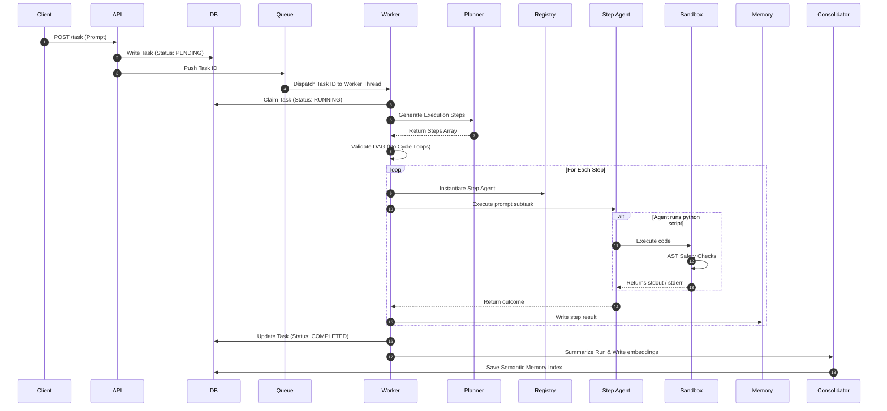

# Multi-Agent AI Platform

Production-oriented Multi-Agent AI Orchestration Platform built with Python, FastAPI, Gemini, SQLAlchemy, SQLite WAL, Docker, and Next.js.

Features dynamic agent discovery, DAG-based workflow orchestration, distributed worker execution, structured memory, secure AST-based Python sandboxing, observability dashboards, CI/CD automation, and production-focused security hardening.

---

## 📖 Table of Contents
1. [Project Overview](#-project-overview)
2. [Key Features](#-key-features)
3. [Architecture Overview](#-architecture-overview)
4. [Agent Workflow Diagram](#-agent-workflow-diagram)
5. [Technology Stack](#-technology-stack)
6. [Installation & Setup](#-installation--setup)
7. [Docker & Containerized Setup](#-docker--containerized-setup)
8. [Environment Variables](#-environment-variables)
9. [API Documentation](#-api-documentation)
10. [Dashboard & Metrics Monitoring](#-dashboard--metrics-monitoring)
11. [Security Guardrails](#-security-guardrails)
12. [Testing & QA Verification](#-testing--qa-verification)
13. [Future Roadmap](#-future-roadmap)
14. [Documentation index](#-documentation-index)

---

## 🌟 Project Overview

The **Multi-Agent AI Platform** provides a robust infrastructure for deploying cooperative AI agent groups. Instead of relying on single-prompt operations, the platform takes a high-level task and uses a **Planner Agent** to generate a Directed Acyclic Graph (DAG) of dependencies. It then assigns steps to specialized worker agents (e.g. Researchers, Developers, Analysts) who cooperate via a transactional **Shared Memory** store and execute scripts within an **AST-Safe Python Sandbox**.

This workspace is security-hardened, containerized, lint-clean, and designed with production-readiness principles for high-concurrency deployments.

---

## 🚀 Key Features

* **Dynamic DAG Planner**: Decomposes user tasks into steps, checks assigned agent schemas, and validates dependency graphs for infinite cycles using DFS.
* **Decoupled Worker Queue**: Multi-threaded Python workers claim tasks from SQLite in Write-Ahead Logging (WAL) mode using `BEGIN IMMEDIATE` transactions to prevent database lockups.
* **AST-Hardened Executor**: Safely runs generated Python code by parsing scripts into an Abstract Syntax Tree (AST), blocking dangerous imports, dynamic evals, and namespace bypasses.
* **Timezone-Safe Datetime Persistence**: Features database architectures utilizing timezone-aware UTC datetime wrappers, eliminating Pytest warnings.
* **Next.js Web Console**: Includes a comprehensive frontend dashboard displaying active queue loads, execution timelines, step statuses, worker heartbeats, and database telemetry.
* **Vector Semantic Memory**: Utilizes long-term memory indexes with cosine similarity search for agent experience recall, coupled with an LLM-powered trace consolidator.

---

## 🏗️ Architecture Overview

The system consists of three main segments:
1. **API Web Layer (FastAPI)**: Ingests tasks, serves history logs, lists active agents, and tracks worker state.
2. **Worker Pool (Python threads)**: Claims tasks, coordinates the step-by-step workflow loop, runs sandbox scripts, and synchronizes memory.
3. **Database (SQLite WAL)**: Provides transactional state storage and persistence.

```
                  +-----------------------+
                  |  Next.js 15 Frontend  |
                  +-----------+-----------+
                              | HTTP / WebSockets
                              v
                  +-----------------------+
                  |    FastAPI Server     |
                  +-----------+-----------+
                              |
                     +--------+--------+
                     |                 |
                     v                 v
            +-----------------+   +----+------------------+
            | SQLite (WAL) DB |   | Task Queue (In-Memory)|
            +-----------------+   +----+------------------+
                     ^                 |
                     | Sync            | Dispatch Task ID
                     |                 v
            +--------+-----------------+------------------+
            |             Worker Pool (Threads)           |
            |  +---------------------------------------+  |
            |  |            Workflow Engine            |  |
            |  |  +---------+  +---------+  +-------+  |  |
            |  |  | Planner |  | Memory  |  |Agents |  |  |
            |  |  +---------+  +---------+  +-------+  |  |
            |  +---------------------------------------+  |
            +---------------------------------------------+
```

For a comprehensive breakdown, see the [Architecture Documentation](file:///E:/multi-agent-system/docs/ARCHITECTURE.md).

---

## 🔄 Agent Workflow Diagram



---

## 🛠️ Technology Stack

* **Back-End**: Python 3.11, FastAPI, SQLAlchemy ORM, Pydantic v2
* **Front-End**: Next.js 15, React, Chart.js, Vanilla CSS
* **Database**: SQLite (configured with WAL journaling and NORMAL synchronizations)
* **Testing & Tools**: Pytest, Black formatter, Ruff linter, Bandit security scanner
* **Docker**: Multi-stage Linux images and Docker Compose orchestrations

---

## ⚙️ Installation & Setup

### Prerequisites
* Python 3.11+
* Node.js 18+ (for running the dashboard locally without Docker)
* Gemini API Key (set as `GEMINI_API_KEY`)

### Local Setup (Without Docker)

1. **Clone the repository**:
   ```bash
   cd E:/multi-agent-system
   ```

2. **Set up the virtual environment**:
   ```bash
   python -m venv venv
   .\venv\Scripts\activate
   pip install -r requirements.txt
   ```

3. **Configure Environment Variables**:
   ```bash
   copy .env.example .env
   # Add your GEMINI_API_KEY in the .env file
   ```

4. **Run the Back-End Server**:
   ```bash
   python main.py
   ```
   *The server starts on [http://localhost:8000](http://localhost:8000). Documentation is available at [http://localhost:8000/docs](http://localhost:8000/docs).*

5. **Run the Front-End Dashboard**:
   ```bash
   cd dashboard
   npm install
   npm run dev
   ```
   *The dashboard starts on [http://localhost:3000](http://localhost:3000).*

---

## 📦 Docker & Containerized Setup

To start the complete, containerized stack (FastAPI Backend, Task Workers, Next.js Dashboard, and Shared Volumes):

1. **Copy the Env file**:
   ```bash
   cp .env.example .env
   # Set your variables and keys inside .env
   ```

2. **Build and start containers**:
   ```bash
   docker compose up --build -d
   ```

3. **Verify the services**:
   * FastAPI: [http://localhost:8000/docs](http://localhost:8000/docs)
   * Web Dashboard: [http://localhost:3000/](http://localhost:3000/)

4. **Shutdown services**:
   ```bash
   docker compose down
   # Use 'docker compose down -v' to wipe database persistent volume
   ```

---

## 🔑 Environment Variables

Configure these settings inside your `.env` file:

```ini
# Gemini API Settings
GEMINI_API_KEY=your-gemini-api-key-here

# Persistence Configuration
PERSIST_PATH=./data
WORKSPACE_DIR=./data/workspace

# Execution Limits
TIMEOUT_SECONDS=30
MAX_OUTPUT_SIZE=2097152

# Server Configuration
PORT=8000
HOST=0.0.0.0
```

---

## 📡 API Documentation

| Endpoint | Method | Description |
| :--- | :---: | :--- |
| `/task` | `POST` | Dispatches task to background worker pool. Returns `session_id`. |
| `/chat` | `POST` | Synchronously executes task, blocking until agents finish. |
| `/status` | `GET` | Retrieves the workflow progress and step-by-step state logs. |
| `/history` | `GET` | Retrieves full execution log strings and agent messages transcripts. |
| `/agents` | `GET` | Lists all registered agents and their configured schemas. |
| `/tasks` | `GET` | Lists all tasks recorded in the database. |
| `/tasks/{task_id}`| `DELETE`| Cancels a running or queued background task. |
| `/workers` | `GET` | Lists active worker heartbeats (PIDs, hostnames, active tasks). |
| `/queue/status` | `GET` | Returns active tasks count grouped by status. |
| `/memory/search` | `GET` | Runs semantic cosine similarity query over long-term memory. |
| `/memory/consolidate` | `POST` | Triggers summary generation and saves it to the vector index. |
| `/metrics` | `GET` | Retrieves all performance counters and system metrics. |

---

## 📊 Dashboard & Metrics Monitoring

The Next.js dashboard provides complete visibility into system operations:
* **Task Monitor**: Showcases running, pending, and completed tasks. Clicking a task opens its real-time log trace.
* **Performance Telemetry**: Integrates charts illustrating queue wait times, agent execution metrics, and database access logs.
* **Worker Cluster Status**: Displays online workers, their current memory profiles, PIDs, and active task ownership.

To explore a detailed demo flow, see the [Demo Script Guide](file:///E:/multi-agent-system/docs/DEMO_SCRIPT.md).

---

## 🛡️ Security Guardrails

The platform implements five strict security containment layers:
1. **AST-Parsing Python Sandbox**: Validates user/agent code before execution, explicitly blocking low-level modules (`os`, `sys`, `subprocess`, `ctypes`) and reflection attempts (`__subclasses__`).
2. **Directory Confinement**: Filesystem tools resolve paths fully to verify they are locked inside the configured `WORKSPACE_DIR` directory component comparison, blocking symlink escapes.
3. **API Integrity & BOLA Protections**: Enforces alphanumeric validation on parameters and verifies request IDs against the database task owner to block unauthorized cancels or reads.
4. **Active Log Redaction**: Custom log formatting filters out authorization keys and password parameters from stdout and logs.
5. **Memory Size Validation**: Limits memory variables to 5MB and requires JSON serialization to prevent heap corruptions.

For further security specifications, review the [Security Policy](file:///E:/multi-agent-system/SECURITY.md).

---

## 🧪 Testing & QA Verification

Our test suite contains **61 comprehensive integration and security verification tests** covering sandbox validation, path traversals, rate limiting, and database claims.

To execute tests locally, activate your virtual environment and run:
```bash
python -m pytest
```

### Key Test Results:
* **61 tests passed** successfully.
* Codebase deprecation warnings reduced from **636 down to 2** (only upstream third-party alerts remain).
* Under stress tests simulating load, SQLite WAL achieved high transaction resiliency with minimal database write conflicts while executing 1,000 parallel claims at **108 tasks/sec**.

---

## 🗺️ Future Roadmap

1. **Multi-Host Worker Clusters**: Allow workers running on separate server instances to claim tasks from a distributed CockroachDB/PostgreSQL database.
2. **Dynamic Docker Containers**: Spin up isolated, temporary Docker containers per task run to replace the AST-safe sandbox for absolute workspace virtualization.
3. **Websocket Log Streams**: Implement native websocket servers for instant log feeds on the front-end console.
4. **LlamaIndex Integration**: Add compatibility for structured LlamaIndex document pipelines to enhance the long-term semantic memory storage index.

---

## 📂 Documentation Index

All technical documents, presentations, and case studies are available in the repository:

* **Systems Architecture**: Detailed data models, PRAGMA database settings, and Mermaid charts. [docs/ARCHITECTURE.md](file:///E:/multi-agent-system/docs/ARCHITECTURE.md)
* **Portfolio Case Study**: In-depth analysis of engineering challenges, performance metrics, and security fixes. [docs/PORTFOLIO_CASE_STUDY.md](file:///E:/multi-agent-system/docs/PORTFOLIO_CASE_STUDY.md)
* **Client Presentation Guide**: Business return on investment (ROI), client-ready workflows, and licensing cases. [docs/CLIENT_PRESENTATION.md](file:///E:/multi-agent-system/docs/CLIENT_PRESENTATION.md)
* **Resume project Summary**: Copy-pasteable resumes summaries, tech stack keywords, and metrics. [docs/RESUME_SUMMARY.md](file:///E:/multi-agent-system/docs/RESUME_SUMMARY.md)
* **System Demo Script**: A 5-to-10 minute presentation guide outlining user interactions. [docs/DEMO_SCRIPT.md](file:///E:/multi-agent-system/docs/DEMO_SCRIPT.md)
* **Contribution Standards**: Development environment instructions and formatting requirements. [CONTRIBUTING.md](file:///E:/multi-agent-system/CONTRIBUTING.md)
* **Vulnerability Reporting Policy**: Guidelines for security disclosures. [SECURITY.md](file:///E:/multi-agent-system/SECURITY.md)
* **Community Code of Conduct**: Standard guidelines for contributors. [CODE_OF_CONDUCT.md](file:///E:/multi-agent-system/CODE_OF_CONDUCT.md)
* **Version Changelog**: Release history of the system. [CHANGELOG.md](file:///E:/multi-agent-system/CHANGELOG.md)
* **License**:MIT License details. [LICENSE](file:///E:/multi-agent-system/LICENSE)
