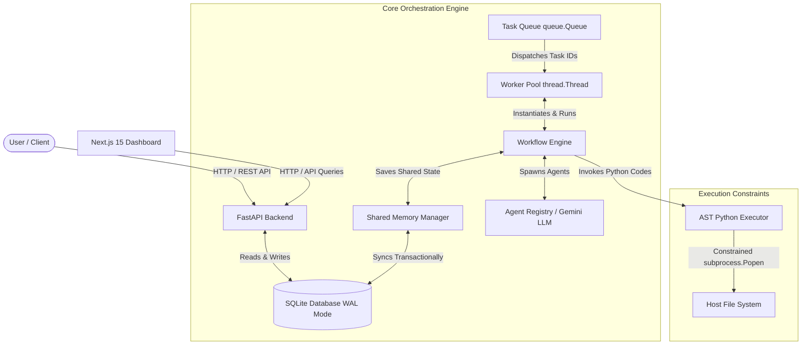
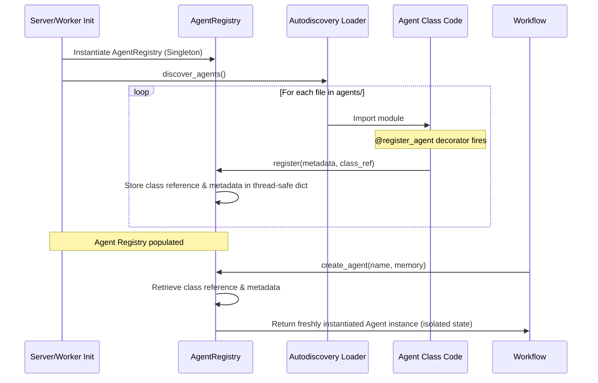
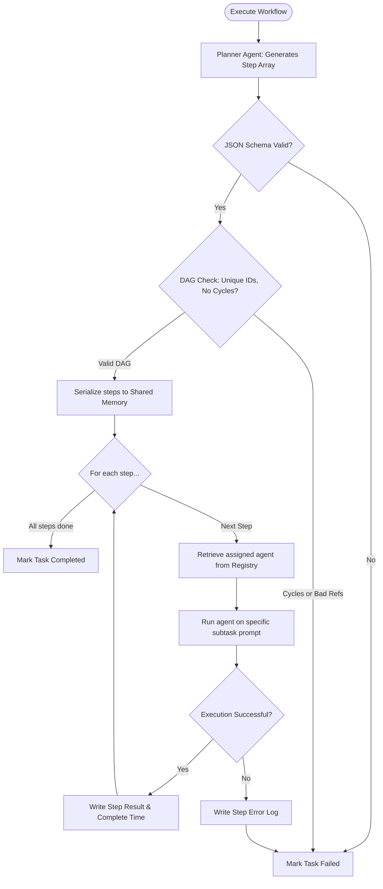
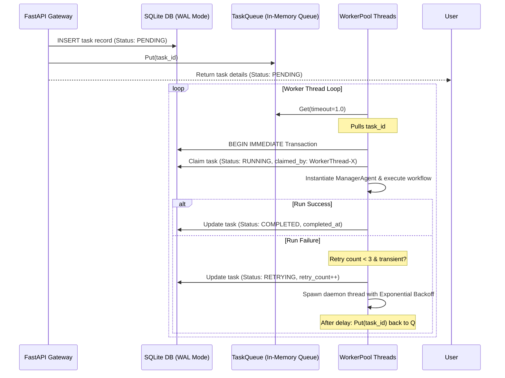

# Architecture Overview

This document describes the design, data flows, components, and security layers of **CodeOrbit AI**. The platform is built using a clean, decoupling-focused architecture combining a high-performance **FastAPI** web service, an asynchronous **SQLite-backed task queue**, concurrent **Worker threads**, and a **Next.js 15** admin dashboard.

---

## 1. System Architecture

The platform's components interact asynchronously to accept, queue, execute, monitor, and record multi-agent executions.



---

## 2. Agent Registry Flow

The [AgentRegistry](file:///E:/multi-agent-system/core/registry.py#L66-L89) is a thread-safe registry utilizing Python class decorators to register and configure agent types dynamically. It separates agent class definitions from active execution states to prevent thread memory leaks.



### Registry Features
* **Decorator-Based Registration**: The `@register_agent` class decorator defines metadata, capabilities, tools, and JSON schema boundaries directly inline.
* **Autodiscovery**: The system uses `pkgutil.iter_modules` to scan the [agents/](file:///E:/multi-agent-system/agents) package and import modules automatically, populating the registry on startup.
* **State Isolation**: When requested by a workflow, the registry instantiates a *fresh instance* of the agent class to ensure different concurrent tasks do not contaminate shared agent fields.

---

## 3. Workflow Engine Flow

The [WorkflowEngine](file:///E:/multi-agent-system/core/workflow.py#L31-L241) coordinates multi-agent execution by taking a user prompt, generating an execution plan, validating that plan as a Directed Acyclic Graph (DAG), and executing steps sequentially using registered agents.



### Graph Validation and Cycle Detection
To prevent deadlock and infinite loops inside agent planning, the `WorkflowEngine` performs a graph validation cycle:
1. **DAG Verification**: Runs a Depth First Search (DFS) recursion using three-state tracking (unvisited, visiting, visited) to identify dependency loops.
2. **Registry Verification**: Verifies that every step's `assigned_agent` is registered and valid.
3. **Reference Verification**: Ensures all elements inside `dependencies` arrays match valid step IDs.

---

## 4. Task Queue & Worker Flow

The system uses an asynchronous SQLite-backed task queue ensuring persistence across worker failures and system restarts.



### SQLite Write-Ahead Logging (WAL) Mode
SQLite WAL mode enables high concurrency by allowing writers to write to a log file while readers read from the main database file. This yields:
* **Resilient Concurrency**: Minimizes database write lock conflicts during parallel task execution.
* **Transactional Claims**: Workers lock rows transactionally using SQLAlchemy-based session boundaries.
* **Automatic Recovery**: On worker startup, [recover_tasks()](file:///E:/multi-agent-system/core/queue.py#L301-L330) scans the database and re-enqueues incomplete tasks left in intermediate execution states.

---

## 5. Worker Architecture

The worker pool runs entirely in the background as a daemon process:
* **Worker Pools**: Sized by default to 2 threads in development to prevent Gemini API quota limits (429), and scales dynamically in production.
* **Periodic Heartbeats**: Active workers register their PID, host name, status, and active task in the [worker_heartbeats](file:///E:/multi-agent-system/core/database.py#L150-L163) table, updating every execution loop to provide cluster-wide visibility.
* **Graceful Shutdown**: The worker threads listen to a `stop_event` signaling thread exits. The pytest runner calls clean `return` statements instead of `sys.exit(0)` to prevent Pytest warnings.

---

## 6. Memory Architecture

The [SharedMemory](file:///E:/multi-agent-system/core/memory.py#L39-L202) module provides state-sharing, message logging, and long-term vector memory persistence:

1. **Short-Term Context**: Maintained during execution in a JSON-serialized Pydantic class (`MemoryState`) containing `data`, `logs`, and `messages`.
2. **Database Sync**: Every update to memory executes a transactional write to SQLite tables:
   * Variables are written to `tasks.variables_json`.
   * Execution logs are written to `task_logs`.
   * Dynamic communications are written to `agent_messages`.
   * Steps are synchronized with the `workflow_executions` table.
3. **Long-Term Semantic Memory**:
   * Stored in the `memory_entries` table.
   * Leverages Gemini embeddings (`text-embedding-004`) to generate text vectors.
   * Offers high-performance cosine similarity calculations to fetch relevant contextual history based on query strings.
4. **Memory Consolidation**: At the conclusion of each task run, the [MemoryConsolidator](file:///E:/multi-agent-system/core/memory.py#L388-L464) queries Gemini to analyze raw execution traces and summarize key achievements, design decisions, and lessons learned. The output is pushed to the semantic long-term memory index.

---

## 7. Database Design

The schema runs on SQLite with indexes optimized for task querying, logging, and status reporting:

```
+---------------------------------------------------------+
|                          tasks                          |
+-------------------+--------------+----------------------+
| Column            | Type         | Constraints          |
+-------------------+--------------+----------------------+
| task_id           | VARCHAR(50)  | PRIMARY KEY          |
| user_id           | VARCHAR(50)  | Index                |
| task_type         | VARCHAR(50)  | Index                |
| payload_json      | JSON         | NOT NULL             |
| status            | VARCHAR(20)  | Index                |
| variables_json    | JSON         |                      |
| claimed_by        | VARCHAR(50)  | Index                |
| created_at        | DATETIME     |                      |
| started_at        | DATETIME     |                      |
| completed_at      | DATETIME     |                      |
| retry_count       | INTEGER      |                      |
| error             | TEXT         |                      |
+-------------------+--------------+----------------------+

+---------------------------------------------------------+
|                        task_logs                        |
+-------------------+--------------+----------------------+
| id                | VARCHAR(50)  | PRIMARY KEY          |
| task_id           | VARCHAR(50)  | FK (tasks.task_id)   |
| timestamp         | DATETIME     | Index                |
| source            | VARCHAR(50)  |                      |
| message           | TEXT         |                      |
| level             | VARCHAR(10)  | Index                |
+-------------------+--------------+----------------------+

+---------------------------------------------------------+
|                     agent_messages                      |
+-------------------+--------------+----------------------+
| id                | VARCHAR(50)  | PRIMARY KEY          |
| task_id           | VARCHAR(50)  | FK (tasks.task_id)   |
| role              | VARCHAR(20)  |                      |
| agent_name        | VARCHAR(50)  | Index                |
| content           | TEXT         |                      |
| timestamp         | DATETIME     |                      |
+-------------------+--------------+----------------------+

+---------------------------------------------------------+
|                     memory_entries                      |
+-------------------+--------------+----------------------+
| id                | VARCHAR(50)  | PRIMARY KEY          |
| session_id        | VARCHAR(50)  | Index                |
| text              | TEXT         |                      |
| metadata_json     | JSON         | (Stores embeddings)  |
| timestamp         | DATETIME     |                      |
+-------------------+--------------+----------------------+

+---------------------------------------------------------+
|                  workflow_executions                    |
+-------------------+--------------+----------------------+
| id                | VARCHAR(50)  | PRIMARY KEY          |
| task_id           | VARCHAR(50)  | FK (tasks.task_id)   |
| step_id           | INTEGER      | Index                |
| name              | VARCHAR(100) |                      |
| description       | TEXT         |                      |
| assigned_agent    | VARCHAR(50)  |                      |
| status            | VARCHAR(20)  | Index                |
| result            | TEXT         |                      |
| started_at        | DATETIME     |                      |
| completed_at      | DATETIME     |                      |
+-------------------+--------------+----------------------+

+---------------------------------------------------------+
|                    worker_heartbeats                    |
+-------------------+--------------+----------------------+
| worker_id         | VARCHAR(50)  | PRIMARY KEY          |
| hostname          | VARCHAR(100) |                      |
| pid               | INTEGER      |                      |
| startup_time      | DATETIME     |                      |
| last_seen         | DATETIME     | Index                |
| active_task_id    | VARCHAR(50)  |                      |
| status            | VARCHAR(20)  |                      |
+-------------------+--------------+----------------------+
```

---

## 8. Security Layers

To enable safe multi-agent capabilities, the platform implements several overlapping security layers:

1. **Workspace Confinement**: 
   * Handled by `validate_safe_path()` in [base.py](file:///E:/multi-agent-system/tools/base.py#L82).
   * Fully resolves symlinks and relative traversals via `Path.resolve()` before comparing paths.
   * Compares directory components rather than raw string prefixes, preventing common prefix bypasses.
   * Enforces a 10MB read/write size limit.
2. **AST Code Execution Sandbox**:
   * Handled by [python_executor.py](file:///E:/multi-agent-system/tools/python_executor.py#L95).
   * Parses Python code into an Abstract Syntax Tree (AST) before running.
   * Blocks direct/indirect imports of OS-level libraries (e.g. `os`, `sys`, `subprocess`, `importlib`).
   * Rejects accessing double-underscore properties (`__subclasses__`, `__class__`) used for escaping standard python namespaces.
   * Spawns subprocesses with drained streams, enforcing a 30s timeout and a 2MB buffer cap.
3. **API & Input Hardening**:
   * Limits payload size globally via FastAPI request stream middlewares.
   * Enforces alphanumeric validation (`^[a-zA-Z0-9_\-]+$`) on all query and body keys.
   * Mitigates Broken Object Level Authorization (BOLA) by validating that the user ID requesting task details is database-matched to the task owner.
4. **Log Data Redaction**:
   * The custom `SecretRedactingFormatter` in [logging.py](file:///E:/multi-agent-system/core/logging.py) automatically strips raw API key signatures, bearer authorization tokens, and password keys.
5. **Memory Constraint Checks**:
   * Restricts memory modification of system keys.
   * Restricts stored keys to under 100 characters.
   * Rejects non-JSON serializable objects and enforces a 5MB value size cap in [memory.py](file:///E:/multi-agent-system/core/memory.py#L49-L77).
