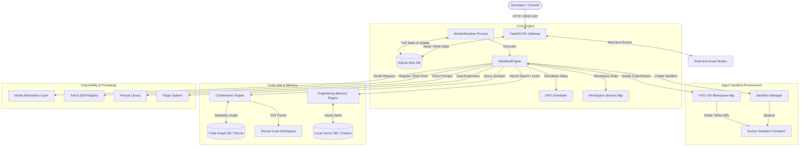

# CodeOrbit AI v2.2 Architecture Specification (FROZEN)

> **Status:** ARCHITECTURE FREEZE APPROVED  
> **Version:** 2.2.0  
> **Type:** Master Design Specification & Traceability Matrix  
> **Single Source of Truth for Future Development**

---

## 1. Executive Summary & Design Goals

To fulfill the mission defined in the **CodeOrbit AI Constitution**, the platform must undergo a structural evolution. CodeOrbit AI v2 transitions the system from a linear, script-running queue into a stateful, repository-aware autonomous agent platform.

### Core Architectural Goals:
1. **Deep Repository-Awareness:** The system must map codebase structures, call graphs, and definitions dynamically, replacing shallow filename heuristics with AST parsing and semantic vector search.
2. **True Isolated Safety:** The AST-based blocklist running on the host system will be retired. Agent execution must run inside containerized, resource-bounded sandboxes with complete credential isolation.
3. **Transactional Workspace Integrity:** The filesystem must remain clean. Filesystem edits will be isolated inside virtual worktrees and Git-backed workspace managers.
4. **Closed-Loop Self-Correction:** Developers and reviewers will operate in a test-driven self-correction loop, iteratively running tests and fixing errors before presenting code to humans.
5. **Stateful Human-in-the-Loop (HITL):** Workflow orchestration will support suspended states, letting agents pause for feedback, secrets, or approvals, and resume deterministically.

---

## 2. System Architecture Overview

CodeOrbit AI v2 divides responsibilities into decoupled, highly-cohesive subsystems.



---

## 3. Subsystem Specifications

### 3.1 CodeIndexer & Code Graph Engine
* **Responsibility:** Parses source files to extract symbols, classes, methods, imports, and docstrings. Builds a dependency graph.
* **Storage:** A dedicated tableset in the SQLite database (`symbol_nodes`, `symbol_edges`) mapping definitions and call graphs.
* **Technology:** AST modules for Python and `tree-sitter` for JavaScript/TypeScript. Runs incrementally via a file watcher daemon (`IndexerDaemon`) to prevent startup latency on large codebases.

### 3.2 SandboxManager (Containerized Execution)
* **Responsibility:** Provisions, runs, and tears down secure runtime environments for agent scripts.
* **Isolation Boundary:** Ephemeral Docker containers based on a secured runner image (`codeorbit-runner:latest`) with:
  * Network requests routed through a secure, restricted bridge network.
  * System resource constraints (e.g., 512MB RAM, 1 CPU core limit).
  * Mounting only the isolated VFS workspace folder.

### 3.3 VFS & Git Workspace Manager
* **Responsibility:** Prevents corrupting the main codebase during development tasks.
* **Mechanism:** 
  * Automatically creates a transient worktree or branch `agent/task_<id>`.
  * Generates Unified Diffs of modified code blocks.
  * Only commits and merges to the main codebase after successful review and human sign-off.

### 3.4 DAGScheduler & Workflow Engine
* **Responsibility:** Sequences and schedules multi-agent tasks using topological sorting.
* **Algorithm:** Runs Kahn's Algorithm on plan steps to resolve dependencies, allowing independent branches of steps to run in parallel using a thread-safe task runner.

### 3.5 Interactive HITL Orchestrator
* **Responsibility:** Pauses execution when approval, review, or credentials are required.
* **State Management:** Suspends worker threads by persisting the step context and memory to the database with a `WAITING_FOR_HUMAN` status, freeing the worker thread back to the pool. Re-queues the task upon receiving the human response callback.

### 3.6 Engineering Memory (RAG, Ledgers & Compactor)
* **Responsibility:** A unified memory subsystem encapsulating semantic context search, episodic experience storage, and token budget management.
* **Components:**
  * **RAG Engine:** Chunks files (retaining line boundaries) and generates embeddings for local hybrid vector search.
  * **Experience Ledger:** Persists past task execution outcomes, failure traces, and code resolutions. Similarity matching retrieves lessons to auto-remediate past execution mistakes.
  * **Context Compactor:** Skeletonizes code files (removing method bodies and keeping signatures) to fit code within model context windows.

### 3.7 Model Abstraction Layer
* **Responsibility:** Standardizes agent interaction with LLMs (Gemini, Claude, GPT), supporting model fallback cascades, retry budgets, temperature tuning, and structured JSON output validation.

### 3.8 Tool & Skill Registry
* **Responsibility:** Centralizes registration, verification, and role-based permissions of execution tools and agent skills.
* **Mechanisms:**
  * **Tool Registry:** Restricts tool access depending on the agent's role (e.g., the Researcher Agent cannot access filesystem modification tools).
  * **Skill Registry:** Loads and interprets procedural text skills (custom workflow recipes and instruction sheets) to extend agent runtime behaviors without modification of the base code.

### 3.9 Prompt Library
* **Responsibility:** Decouples prompt text and system instructions from Python implementation code. Holds version-controlled system instructions, system personas, and few-shot examples.

### 3.10 Plugin System
* **Responsibility:** Exposes lifecycle hooks (`on_startup`, `on_task_claim`, `on_step_complete`, `on_shutdown`) for third-party extensions (e.g., CI/CD triggers, Slack alerts, Jira updates).

### 3.11 Workspace Session Management
* **Responsibility:** Tracks stateful workspace allocations per task session, including active Git worktrees, active sandbox container containers, file lock allocations, and task owner credentials.

### 3.12 Real-time Event Broker
* **Responsibility:** Streams agent execution details (logs, token streams, resource usage) to the Next.js web console in real-time.
* **Technology:** FastAPI WebSockets backed by an in-memory Pub/Sub broker, resolving the database-polling latency.

---

## 4. Core Execution Flows

### 4.1 Development & Self-Correction Flow
This flow represents the closed-loop implementation cycle inside the isolated container sandbox.

```mermaid
sequenceDiagram
    autonumber
    participant Engine as WorkflowEngine
    participant VFS as VFS Manager
    participant Box as Sandbox Container
    participant Dev as Developer Agent
    participant Rev as Reviewer Agent

    Engine->>VFS: Initialize isolated worktree branch
    Engine->>Box: Spawn ephemeral runner container
    
    loop Development Iteration (Max Retries: 5)
        Engine->>Dev: Request subtask implementation
        Dev->>VFS: Write code diffs
        VFS->>Box: Copy changes to sandbox mount
        Engine->>Box: Run test commands & linters
        Box-->>Engine: Return stdout, stderr, exit code
        
        alt Exit Code != 0 (Failed Tests/Lints)
            Engine->>Rev: Send code diff & stack trace
            Rev->>Dev: Provide debugging directives
        else Exit Code == 0 (Passed validation)
            Engine->>Rev: Request final code review
            Rev-->>Engine: Code approved
            Note over Engine, Rev: Break Loop
        end
    end
    
    Engine->>VFS: Create pull request/unified diff
    Engine->>Box: Destroy sandbox container
```

---

## 5. Subsystem Interfaces (API Declarations)

The core subsystems will implement the following strictly-typed Python interfaces:

### 5.1 Sandbox Interface
```python
class SandboxExecutionResult(BaseModel):
    exit_code: int
    stdout: str
    stderr: str
    duration_seconds: float
    timeout_exceeded: bool

class ISandbox(Protocol):
    def start(self) -> None:
        """Provisions and starts the isolated container environment."""
        ...

    def execute(self, cmd: List[str], timeout: float = 30.0) -> SandboxExecutionResult:
        """Executes a command inside the container and returns stdout/stderr."""
        ...

    def copy_in(self, local_path: str, remote_path: str) -> None:
        """Safely writes a file or directory into the sandbox."""
        ...

    def copy_out(self, remote_path: str, local_path: str) -> None:
        """Safely retrieves a file or directory from the sandbox."""
        ...

    def terminate(self) -> None:
        """Forcefully stops and deletes the container instance."""
        ...
```

### 5.2 Workspace Interface
```python
class FileChange(BaseModel):
    file_path: str
    action: Literal["add", "modify", "delete"]
    content: str  # Original content or unified diff

class IWorkspaceManager(Protocol):
    def create_workspace(self, task_id: str) -> str:
        """Creates an isolated git worktree / branch and returns its absolute path."""
        ...

    def stage_changes(self, task_id: str, changes: List[FileChange]) -> None:
        """Stages file edits on the isolated workspace branch."""
        ...

    def generate_diff(self, task_id: str) -> str:
        """Returns the unified diff of the worktree against the parent branch."""
        ...

    def commit_and_merge(self, task_id: str) -> bool:
        """Applies the changes to the primary repository branch after sign-off."""
        ...

    def destroy_workspace(self, task_id: str) -> None:
        """Removes worktrees and cleans up git state."""
        ...
```

### 5.3 CodeIndexer Interface
```python
class SymbolDefinition(BaseModel):
    name: str
    symbol_type: Literal["class", "function", "module", "decorator"]
    file_path: str
    start_line: int
    end_line: int
    docstring: Optional[str]
    imports: List[str]

class ICodeIndexer(Protocol):
    def index_repository(self, repo_path: str) -> None:
        """Walks the repository, parses ASTs, and writes symbols to Code Graph DB."""
        ...

    def find_symbol(self, name: str) -> List[SymbolDefinition]:
        """Queries Code Graph DB to locate a class or function declaration."""
        ...

    def get_references(self, symbol_name: str) -> List[str]:
        """Returns paths to all source files that import or call the symbol."""
        ...
```

### 5.4 Model Abstraction Interface
```python
class ModelParameters(BaseModel):
    temperature: float = 0.0
    max_tokens: int = 4096
    response_format: Optional[Dict[str, Any]] = None

class IModelProvider(Protocol):
    def generate(self, prompt: str, system_instruction: str, params: ModelParameters) -> str:
        """Sends generation requests to the active LLM provider."""
        ...

    def generate_structured(self, prompt: str, schema: Type[BaseModel], system_instruction: str, params: ModelParameters) -> BaseModel:
        """Queries the LLM and guarantees JSON compliance against a Pydantic schema."""
        ...
```

### 5.5 Tool & Skill Registry Interface
```python
class ToolDefinition(BaseModel):
    name: str
    description: str
    args_schema: Type[BaseModel]
    required_capabilities: List[str]

class IToolRegistry(Protocol):
    def register_tool(self, name: str, tool_instance: Any, capabilities: List[str]) -> None:
        """Registers a tool inside the platform catalog."""
        ...

    def get_agent_tools(self, agent_role: str, agent_capabilities: List[str]) -> List[Any]:
        """Filters and retrieves permitted tools for a specific agent role."""
        ...
```

### 5.6 Workspace Session Interface
```python
class SessionState(BaseModel):
    task_id: str
    workspace_path: str
    container_id: Optional[str]
    git_branch: str
    created_at: datetime
    last_active: datetime

class IWorkspaceSessionManager(Protocol):
    def start_session(self, task_id: str) -> SessionState:
        """Allocates resources and registers active tracking session details."""
        ...

    def end_session(self, task_id: str) -> None:
        """Releases containers, branches, and cleans up task directories."""
        ...
```

---

## 6. Security Boundary & Credential Protection

An autonomous agent operating in a codebase requires access to dependencies but must *never* compromise host system credentials or repository origin permissions.

* **Host vs. Sandbox Separation:** The sandbox container has no access to host environment variables, host SSH keys, or the `.git` folder of the origin repository.
* **Workspace Bridging:** 
  * The `VFSManager` runs exclusively on the host process space, utilizing local credentials to create isolated transient worktree folders.
  * The sandbox container is granted read-write access *only* to the local transient folder.
  * Git actions (commits, pushes, pull requests) are carried out by the host workspace manager on behalf of the agent, ensuring the sandbox remains credential-free.

---

## 7. Scalability & Enterprise Migration Path

To support scaling from local single-user development to concurrent enterprise-level team pipelines:

* **Storage Abstraction:** Database and Vector DB adapters must remain decoupled via the repository pattern. This allows switching the backend storage:
  * **Local Development:** SQLite (WAL mode) + ChromaDB (Local).
  * **Enterprise Production:** PostgreSQL (RDS / Aurora) + pgvector or Neo4j (for advanced call graph traversals).
* **Asynchronous Indexing Daemon:** Code indexing must never block worker runtime execution. A file system event watcher (`watchdog`) will trigger asynchronous incremental indexing background tasks in the celery/worker pool.

---

## 8. Multi-Agent Swarms & Teamwork Protocol

For large refactoring runs, CodeOrbit AI will scale tasks to collaborative swarms of agents.

* **`AgentCommunicationBroker`:** A lightweight message bus allowing agents to pass structured events.
* **Consensus Debate Protocol:**
  * When an agent proposes a design pattern change, it publishes a `PROPOSE_ARCH_CHANGE` event.
  * The **Reviewer Agent** runs tests on the VFS and votes.
  * If validation checks fail, a `REMEDIATE` event is routed to the developer agent.
  * Once consensus is reached, the **Tech Lead Agent** promotes the task status to `WAITING_FOR_HUMAN` for final PR approval.

---

## 9. Traceability Matrix

The following matrix traces every CodeOrbit AI v2.2 subsystem back to its specific mandate in the **CodeOrbit AI Constitution**.

| Subsystem Component | Constitution Section & Mandate | Target Verification Method |
|---|---|---|
| **`SandboxManager`** | *Section 4 & 8: Isolated Safety*<br>Enforce isolated execution boundaries. | `test_security_hardening.py` confirming restricted process permissions. |
| **`VFSManager`** | *Section 4 & 9: Transactional Memory & Workspace Integrity*<br>Prevent file corruption. | E2E worktree rollback checks on execution failure. |
| **`CodeIndexer`** | *Section 2 & 5: Deep Repository-Awareness*<br>AST mapping. | Syntax symbol matches in generated execution plans. |
| **`DAGScheduler`** | *Section 6 & 8: AI Agent Responsibilities*<br>Correct sequencing. | Dependency scheduling checks with Kahn's algorithm. |
| **`ModelProvider`** | *Section 7 & 10: Extensible Architecture & Non-Goals*<br>Model agility. | Model swap verification tests (e.g. Gemini -> Claude). |
| **`Tool & Skill Registry`** | *Section 6 & 8: Role-based Permissions & Safety*<br>Prevent bypass. | Test cases verifying Researcher Agent cannot run write tools. |
| **`Engineering Memory`** | *Section 5: Deterministic Verification & Learning Memory*<br>Recall. | Episodic RAG similarity checks after simulated task errors. |
| **`HITLOrchestrator`** | *Section 3 & 4: Human-in-the-Loop Integration*<br>Human control. | Task suspension and resuming E2E tests. |
| **`Plugin System`** | *Section 4: Maintainability & Extensibility*<br>Extendability. | Mock plugin execution during pipeline hooks. |
| **`Workspace Session Mgr`**| *Section 5: Transactional Memory & Stability*<br>Resource cleanup. | Thread and container leak verification scripts. |

---

## 10. Repository Directory Structure

To support the modularity and separation of concerns required for CodeOrbit AI v2, the repository layout is structured as follows:

```
E:/multi-agent-system/
│
├── api/                             # FastAPI Gateway Layer
│   ├── app.py                       # App initialization
│   ├── routes/                      # API Endpoints (tasks, agents, console)
│   └── dependencies/                # JWT validation, DB sessions
│
├── core/                            # Core Orchestration Subsystems
│   ├── db/                          # Database connection and Migrations
│   │   ├── session.py               # SQLAlchemy engines and event hooks (WAL)
│   │   └── models.py                # DB Models (Tasks, Heartbeats, Symbols)
│   │
│   ├── queue/                       # Decoupled Task Queue System
│   │   └── scheduler.py             # Topologically sorted DAG Scheduler
│   │
│   ├── worker/                      # Daemon Task Consumer
│   │   └── runtime.py               # WorkerRuntime claiming tasks via transactions
│   │
│   ├── sandbox/                     # Containerized Execution Subsystem
│   │   ├── interface.py             # ISandbox interface definition
│   │   └── docker_runner.py         # Docker-based container implementation
│   │
│   ├── workspace/                   # Git-backed Workspace Isolation
│   │   ├── interface.py             # IWorkspaceManager interface
│   │   ├── git_manager.py           # Git worktree & branching implementation
│   │   └── session_manager.py       # WorkspaceSessionManager implementation
│   │
│   ├── indexer/                     # Repository Understanding Subsystem
│   │   ├── interface.py             # ICodeIndexer interface
│   │   ├── ast_parser.py            # AST symbol parsing logic
│   │   └── graph_db.py              # Symbol graph database SQLite mapping
│   │
│   ├── memory/                      # Semantic Memory & Experience Ledgers
│   │   ├── rag_engine.py            # Hybrid keyword/vector indexer
│   │   ├── ledger.py                # Experience / learning memory manager
│   │   └── compactor.py             # LLM Context Compactor / Token budgeter
│   │
│   ├── models/                      # Model Abstraction Layer
│   │   ├── provider.py              # Standard LLM API router
│   │   └── schemas.py               # Structured output formats
│   │
│   ├── registry/                    # Tool, Skill and Prompt Registries
│   │   ├── tool_registry.py         # Role-based tool access manager
│   │   ├── skill_registry.py        # Procedural text skills loader
│   │   └── prompt_library.py        # Versioned prompt repository
│   │
│   ├── plugins/                     # Extensibility hooks
│   │   └── plugin_manager.py        # Third-party lifecycle event dispatcher
│   │
│   └── broker/                      # Real-time WebSocket Event Broker
│       └── events.py                # WebSocket streams & status pub/sub
│
├── agents/                          # Specialized Autonomous Agents
│   ├── base_agent.py                # Base agent ReAct loop & LLM structured query
│   ├── planner.py                   # DAG Plan generator agent
│   ├── developer.py                 # File-writer & implementation agent
│   ├── reviewer.py                  # Code analysis & debugging agent
│   └── researcher.py                # Read-only symbol & documentation finder
│
├── dashboard/                       # Next.js 15 Web Console
│
└── tests/                           # Unit & Integration Verification Suite
    ├── core/                        # Tests for core subsystems (Sandbox, Indexer, etc)
    ├── agents/                      # Tests for agent ReAct logic
    └── integration/                 # E2E workflow & task recovery tests
```

---

## 11. Phased Development Roadmap

Every future sprint is scoped to reference and implement specific components defined in this frozen specification.

### Sprint 1: Sandboxing & Scheduling Core
* **Ref. Subsystems:** [SandboxManager (3.2)](#32-sandboxmanager-containerized-execution), [DAGScheduler (3.4)](#34-dagscheduler-workflow-engine), [Workspace Session Manager (3.11)](#311-workspace-session-management)
* **Goal:** Establish execution safety and dependency sequencing.
* **Deliverables:**
  1. Build Docker-based container isolation (`ISandbox` / `docker_runner.py`).
  2. Implement Kahn's algorithm topological sorting in `DAGScheduler`.
  3. Deploy `WorkspaceSessionManager` for resource allocation.

### Sprint 2: Repository Indexing & Workspace Isolation
* **Ref. Subsystems:** [CodeIndexer (3.1)](#31-codeindexer-code-graph-engine), [VFS & Git Workspace Manager (3.3)](#33-vfs-git-workspace-manager)
* **Goal:** Map repository structures and prevent direct workspace mutations.
* **Deliverables:**
  1. Complete AST Tree-Sitter based symbol parsing (`ICodeIndexer` / `ast_parser.py`).
  2. Set up Git worktree workspace partitioning (`IWorkspaceManager` / `git_manager.py`).

### Sprint 3: Model Abstraction, Prompting & Extensibility
* **Ref. Subsystems:** [Model Abstraction Layer (3.7)](#37-model-abstraction-layer), [Prompt Library (3.9)](#39-prompt-library), [Tool & Skill Registry (3.8)](#38-tool-skill-registry)
* **Goal:** Standardize model calls, separate prompt text, and scope agent tools.
* **Deliverables:**
  1. Build unified LLM interface wrapper (`IModelProvider` / `provider.py`).
  2. Develop role-based permission system (`IToolRegistry` / `tool_registry.py`).
  3. Structure versioned prompt library files (`prompt_library.py`).

### Sprint 4: RAG, Experience Memory & Closed-Loops
* **Ref. Subsystems:** [Engineering Memory (3.6)](#36-engineering-memory-rag-ledgers-compactor)
* **Goal:** Allow agents to search code semantically, fit context budgets, and learn from past failures.
* **Deliverables:**
  1. Build vector-based semantic code retriever (`ISemanticSearch` / `rag_engine.py`).
  2. Develop prompt length compacting algorithm (`IContextCompactor` / `compactor.py`).
  3. Deploy similarity-indexed episodic memory (`IExperienceLedger` / `ledger.py`).

### Sprint 5: Real-time Streaming, Plugins & HITL
* **Ref. Subsystems:** [Interactive HITL Orchestrator (3.5)](#35-interactive-hitlorchestrator), [Plugin System (3.10)](#310-plugin-system), [Real-time Event Broker (3.12)](#312-real-time-event-broker)
* **Goal:** Wire up human-in-the-loop triggers, WebSocket streaming, and plugin extensions.
* **Deliverables:**
  1. Build agent pause/resume workflow states inside task scheduler.
  2. Setup WebSocket Pub/Sub broker to stream token generation and steps to the web dashboard.
  3. Implement event listener dispatchers (`PluginManager` / `plugin_manager.py`).
