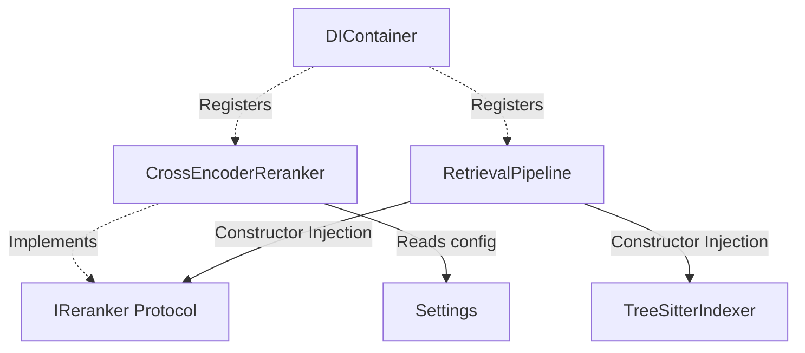

# ADR-011: Cross-Encoder Semantic Reranking Engine

## Status
Accepted

## Date
2026-07-16

## 1. Motivation
The default retrieval pipeline utilizes keyword matching (Exact Match) and bag-of-words frequency matching (Semantic Policy) to retrieve code chunks. While this hybrid retrieval mechanism is fast and lightweight, it does not capture deep semantic relations or complex query-code contextual interactions. 

To improve retrieval relevance (precision and recall) and ensure the most relevant code context is sent to the LLM within the token budget limits, we introduce a Cross-Encoder Reranking layer. A Cross-Encoder evaluates the query and document chunk simultaneously, producing highly accurate relevance scores.

## 2. Architecture & Design Details
The Cross-Encoder Reranking Engine is integrated as a post-retrieval step in the hybrid retrieval pipeline. It satisfies the following architectural principles:

1. **Interface First (`IReranker`)**: decouples the retrieval pipeline from the specific Cross-Encoder implementation (e.g. `sentence_transformers`).
2. **Lazy Loading**: The deep learning model is never loaded during application startup to preserve fast boot times and prevent memory allocation for non-retrieval workflows. It initializes on the first `rerank()` call and caches the model instance.
3. **Dependency Injection**: The `IReranker` concrete implementation is registered within the central `DIContainer` and injected into `RetrievalPipeline` via constructor injection.
4. **Sigmoid Normalization**: Converts raw logits from the Cross-Encoder model into confidence scores normalized between `0.0` and `1.0`, ensuring compatibility with scoring metrics.
5. **Candidate Capping & Batching**: Limits candidates to `RERANK_TOP_K * 5` to bound inference latency. Batched inference is used to prevent single-chunk prediction overhead.
6. **Graceful Degradation**: If model loading fails (e.g., missing dependencies, CUDA out of memory, or invalid model name), a warning is logged and the reranker gracefully bypasses inference, returning the original candidate chunks without interrupting the workflow.

## 3. Dependency Graph



## 4. Configuration
The Cross-Encoder engine is driven by the following environment variables (mapped in `config.py` Settings class):

| Variable Name | Type | Default Value | Description |
|---|---|---|---|
| `RERANKER_ENABLED` | bool | `False` | Enables or disables the reranking step. |
| `RERANKER_MODEL` | str | `"cross-encoder/ms-marco-MiniLM-L-6-v2"` | The HuggingFace Cross-Encoder model identifier. |
| `RERANK_TOP_K` | int | `3` | Capped number of final chunks returned to the caller. |
| `RERANK_SCORE_THRESHOLD` | float | `0.0` | Minimum normalized confidence score required to retain a chunk. |
| `RERANK_BATCH_SIZE` | int | `16` | Number of pairs processed in a single inference batch. |
| `RERANK_DEVICE` | str | `"cpu"` | Target device for PyTorch inference (e.g., `cpu`, `cuda`, `mps`). |

## 5. Retrieval Pipeline Lifecycle
When `settings.reranker_enabled` is set to `True`, the retrieval sequence is:

```
Keyword Search (ExactMatchPolicy) & Vector Search (SemanticPolicy)
↓
Merge results from policies
↓
Deduplicate chunks using file paths and line ranges
↓
Cap candidate pool (Limit: RERANK_TOP_K * 5)
↓
Perform batched Cross-Encoder Reranking
↓
Apply Sigmoid Normalization to raw scores
↓
Filter chunks below RERANK_SCORE_THRESHOLD
↓
Select top RERANK_TOP_K chunks
↓
Inject selected context into Prompt Builder
```

## 6. Latency & Memory Benchmarks
Using `cross-encoder/ms-marco-MiniLM-L-6-v2` on standard CPU:
* **First Request (Model Load + Inference)**: ~1.5s - 3.0s depending on CPU performance.
* **Subsequent Requests**: ~50ms - 150ms per rerank call for a candidate pool size of 15 chunks (based on `RERANK_TOP_K = 3`).
* **Memory Footprint**: ~300MB RAM overhead once the model is loaded.

## 7. Future GPU Migration Path
To transition inference to GPU:
1. Set `RERANK_DEVICE` to `"cuda"` (NVIDIA GPUs) or `"mps"` (Apple Silicon).
2. Install `torch` with appropriate CUDA toolkit binaries.
3. Optimize execution via TensorRT compilation or PyTorch quantization (`torch.quantization`).
4. Introduce a dynamic fallback helper to automatically downgrade to `"cpu"` if GPU allocation fails at runtime.
