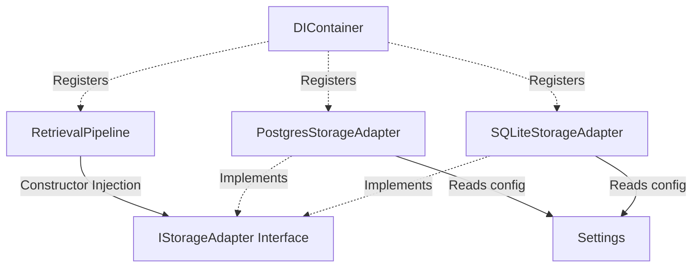

# ADR-012: Storage Abstraction Layer and Multi-Tenant persistence

## Status
Accepted

## Date
2026-07-16

## 1. Motivation
As CodeOrbit AI transitions toward a multi-tenant hosted SaaS model, the persistence architecture must evolve to safely isolate data for thousands of independent organizations sharing the same infrastructure. 

Previously, the retrieval pipeline was tightly coupled to SQLite via direct `sqlite3` connection calls. To support production databases like PostgreSQL, handle concurrent requests, implement strict tenant isolation, and preserve backward compatibility, we require a database-agnostic storage abstraction layer.

## 2. Architecture & Design Details
We introduce the `IStorageAdapter` interface, which encapsulates database operations and exposes only engine-neutral execution methods.

### Key Components:
1. **IStorageAdapter Protocol**: Defines standard transaction control (`begin_transaction`, `commit`, `rollback`) and database statements execution (`execute`, `executemany`, `fetchone`, `fetchall`).
2. **SQLiteStorageAdapter**: Implements thread-local sqlite connections configured in WAL mode, ensuring concurrent read operations do not block.
3. **PostgresStorageAdapter**: Wraps `psycopg2` using a ThreadedConnectionPool for pooled, lazy-loaded connection routing across multiple worker threads.
4. **Statement Translation**: The storage client (e.g. `RetrievalPipeline`) writes standard parameterized SQL using `?` placeholders. The Postgres adapter automatically translates `?` to `%s` at runtime, keeping client queries backend-agnostic.
5. **Thread Safety**: Both adapters maintain connection isolation per execution thread (via `threading.local()`) to prevent resource contention.

## 3. Dependency Graph

## 4. Multi-Tenant Strategy
Tenant isolation is enforced strictly at the database schema level:

1. **Schema Extension**: A `tenant_id` string column is added to all tables (`retrieval_code_symbols`, `retrieval_cache`) and incorporated into the Primary Keys:
   * `PRIMARY KEY (tenant_id, task_id, file_path, symbol_name)`
   * `PRIMARY KEY (tenant_id, task_id, query)`
2. **Thread-Safe Tenant Context**: A global thread-local/async-local context variable `tenant_context` tracks the active tenant ID per request.
3. **Automatic Filtering**: Every retrieval query and write query in `RetrievalPipeline` explicitly binds the active `tenant_id` resolved via context, preventing data leakage across tenants.
4. **Backward Compatibility**: If `enable_multi_tenancy` is disabled in config, the active tenant defaults to `default_tenant_id` ("default_tenant"), preserving compatibility with previous single-tenant sqlite databases.

## 5. Introspection-Based Migration Path
To prevent database errors when upgrading from previous single-tenant versions:
* At initialization, the pipeline executes `init_schema()`.
* It queries the existing schema (via `PRAGMA table_info` in SQLite, or `information_schema.columns` in Postgres).
* If a table exists but lacks the `tenant_id` or `language` columns, it drops the table and recreates the multi-tenant version dynamically.
* If database connection fails on import, it gracefully logs a warning and retries on first query execution.

## 6. Scaling Roadmap
For high-scale hosted environments:
1. **Shared Database / Shared Schema (Current)**: Low overhead, partitioned by `tenant_id`. Suitable for initial SaaS rollout.
2. **Schema-Per-Tenant**: Separate PostgreSQL schemas within the same database, routing queries via search path setup on connection checkout.
3. **Database-Per-Tenant**: Separate physical PostgreSQL databases, routing queries dynamically via a tenant-routing adapter class.
