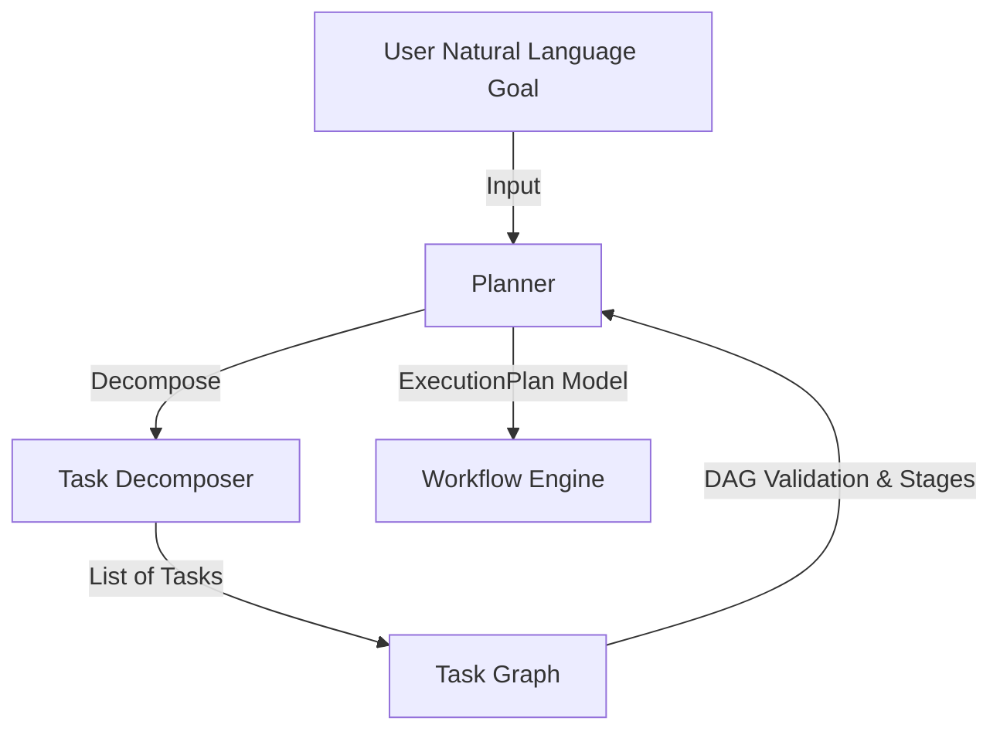

# ADR-013: Autonomous Planning Engine

## Status
Accepted

## Date
2026-07-17

## 1. Motivation
Previously, CodeOrbit AI operated on static, predefined workflow templates. To handle complex, ambiguous, and dynamic software engineering requests, the system must autonomously generate, schedule, and validate its own execution plans. 

By introducing a hierarchical planning engine, we replace hardcoded pipelines with dynamically generated Directed Acyclic Graphs (DAGs) representing sequential and concurrent task execution stages.

## 2. Planning Architecture
We design the planning engine around specialized components separated by clear interfaces:

* **IPlanner**: High-level interface exposing `plan(objective)`, `validate(plan)`, and `health_check()`.
* **ITaskDecomposer**: Handles the translation of natural language goals into distinct atomic steps and estimates task execution complexity.
* **TaskGraph**: Encapsulates validation logic (detecting circular dependencies, unreachable steps, and duplicate IDs) and computes concurrent execution stages.

## 3. Dependency Inference
Dependencies are inferred automatically to guarantee sequential safety:
1. **Rule-Based Mapping**: Predefined execution blueprints for common tasks (e.g., API creation maps: Database Setup $\rightarrow$ API Implementation $\rightarrow$ Testing $\rightarrow$ Deployment).
2. **Topological Layering**: Steps are automatically sequenced by dependency depth so that prerequisites are executed in parallel or sequence before downstream steps begin.

## 4. Complexity Model
Task complexity is estimated dynamically via:
$$\text{Complexity Score} = 2.0 \times N_{\text{files}} + 1.5 \times N_{\text{dependencies}} + 0.05 \times N_{\text{words in description}}$$

* **Score < 2.0**: Low
* **Score < 5.0**: Medium
* **Score < 9.0**: High
* **Score $\ge$ 9.0**: Very High

## 5. Execution Flow
1. **Goal Analysis**: Natural language request parsing.
2. **Decomposition**: Splitting into atomic, deterministic, and serializable `PlanningTask` models.
3. **Graph Building**: Constructing a `TaskGraph` and running cycle-detection validation.
4. **Stage Sequences**: Resolving execution stages using the Kahn topological layers algorithm.
5. **Execution**: WorkflowEngine processes stages sequentially, running independent nodes in parallel or sequence, and reporting status to shared memory.

## 6. Future LLM Planner Integration
While the initial engine utilizes structured, deterministic heuristics to ensure reliable baseline behavior, it is designed for a seamless upgrade to LLM-driven planning:
* **Structured Generation**: `ITaskDecomposer` can call model providers via `generate_structured(response_schema=List[PlanningTask])`.
* **Zero Code Changes**: Because `IPlanner` is registered and resolved dynamically via the DI Container, the LLM Planner implementation can drop in as an alternative class injection without affecting any execution pipelines or WorkflowEngine code.
