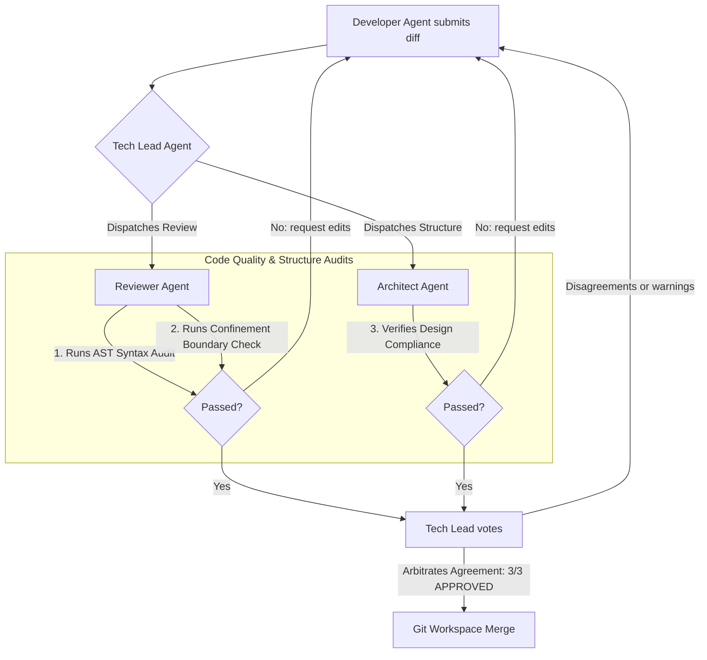

# CodeOrbit AI — Swarm Consensus Workflow

This document details the multi-agent arbitration and consensus checks that govern code modifications.

---

## 🗳️ Swarm Consensus Agreement Loop

CodeOrbit AI enforces a secure peer-review cycle before writing changes to the protected main code branch.

---

## 🛡️ Swarm Roles

* **Developer Agent**: Formulates files modifications, applies code changes, and fixes sandbox failures.
* **Reviewer Agent**: Audits raw Git diffs, checking code readability, styling formatting, and security syntax injection boundaries.
* **Architect Agent**: Confirms changes align with the target subsystems boundaries and database layouts.
* **Tech Lead Agent**: Resolves discrepancies, gathers Swarm votes, and commits approvals.
