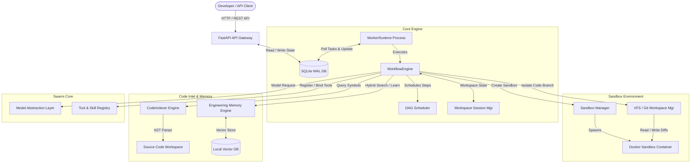

# CodeOrbit AI — Overall Architecture Spec

This document details the service-oriented, transactionally isolated components of **CodeOrbit AI**.

---

## 🏗️ Structural Topography

CodeOrbit AI isolates orchestration logic, sandbox tasks, and intelligence layers to achieve transactional safety during autonomous runs.

---

## 🔗 Subsystem Responsibilities

1. **API Gateway**: Provides REST controllers to queue tasks, fetch real-time session logs, and view worker metrics.
2. **SQLite WAL Database**: Persists task states queue with row-level transaction boundaries.
3. **Core Orchestration**: Dispatches steps, handles lock allocations, and tracks latency metrics.
4. **Workspace Sandbox**: Ephemeral Docker and AST executors preventing host machine pollution.
5. **Repo Intelligence**: Compiles structural AST relations and experience RAG compaction.
