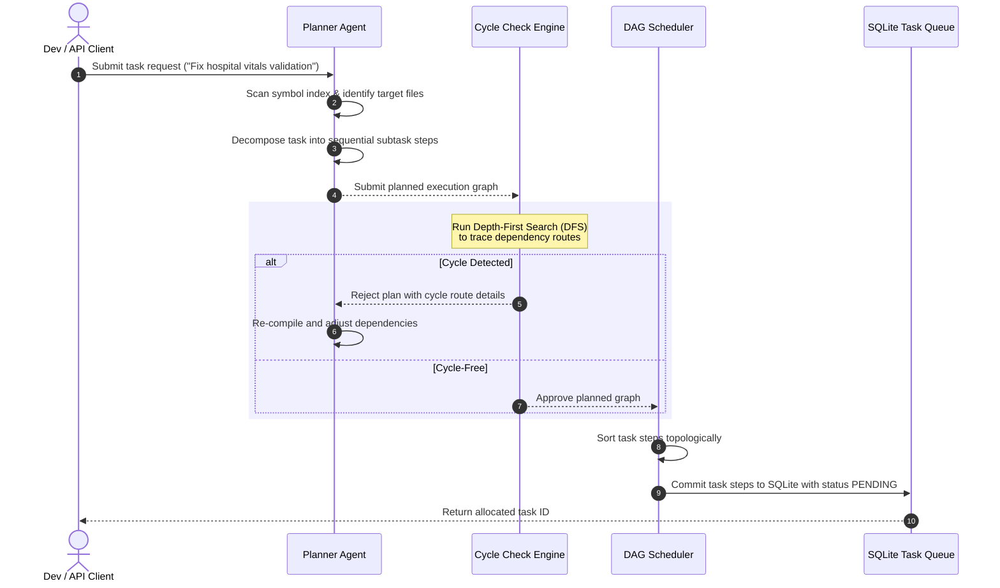

# CodeOrbit AI — Task Planning & DAG Scheduling Flow

This document details how high-level user instructions are compiled into execution task schedules.

---

## 📋 Task Decomposition Flow

CodeOrbit AI decomposes instructions into a topological task graph verified to prevent cycle loops before execution starts.

---

## 📐 Graph Execution Rules

1. **Deterministic Order**: Step execution strictly follows the topological sort order.
2. **Failure Propagation**: If any parent step fails, all downstream successor steps are suspended (status `BLOCKED`) to preserve codebase consistency.
3. **Recovery Boundaries**: Task steps can be re-run from the point of failure after applying manual or automated fixes.
