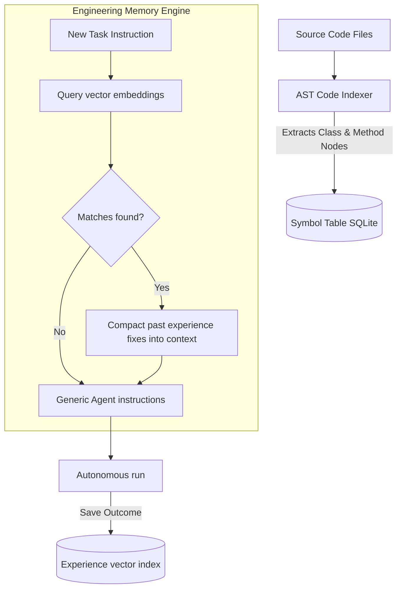

# CodeOrbit AI — Repository Intelligence & Memory Engine

This document details the AST code scanning indexing and long-term experience vector recall system.

---

## 🧠 Code Intelligence & Experience RAG Topology

CodeOrbit AI scans codebase directory syntax to compile code relationships and utilizes semantic experience ledgers to query historical fixes.

---

## 🗂️ Symbol Resolution

* **Dependency Paths**: Scans and parses class dependencies, imports, and function arguments into structural entities.
* **Semantic Compactor**: Condenses past task execution transcripts, keeping model tokens usage concise.
* **Vector Index**: Uses local vector storage schemas to perform cosine-similarity retrieval searches.
