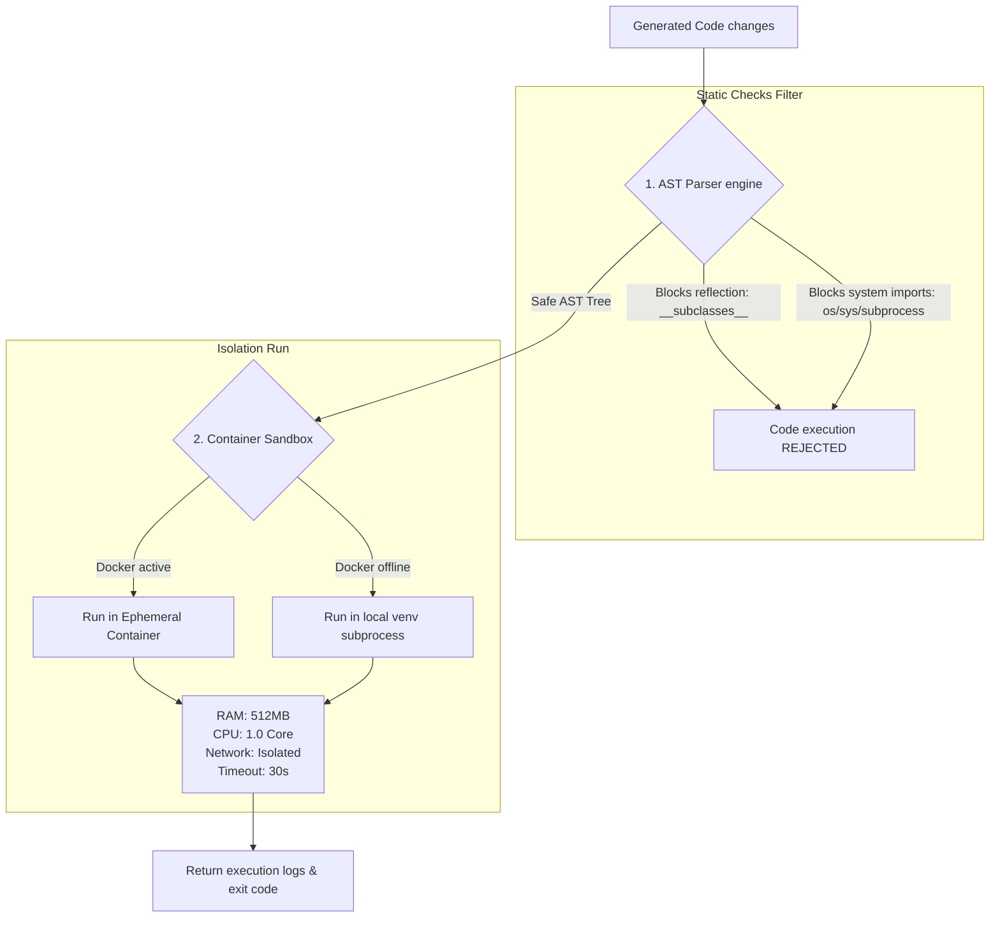

# CodeOrbit AI — Sandbox Isolation & Execution Boundaries

This document details the sandboxing safety check boundaries applied to code executions.

---

## 🛡️ Double-Shield Sandbox Topology

All code executions pass through two separate validation boundaries: static AST syntax filters and containerized sandboxes.

---

## 🔒 Security Policies

1. **Path Confinement**: Path components verification confirms all file read/write actions are fully confined inside the configured `WORKSPACE_DIR` boundary.
2. **Resource Quotas**: Hard quotas are enforced inside container runtimes to prevent Denials of Service (DoS) due to CPU looping or RAM leakage.
3. **Log Redaction**: Outgoing stdout, stderr, and variables log files are filtered via regex keys scrubbers to sanitize API key structures or passwords before saving.
