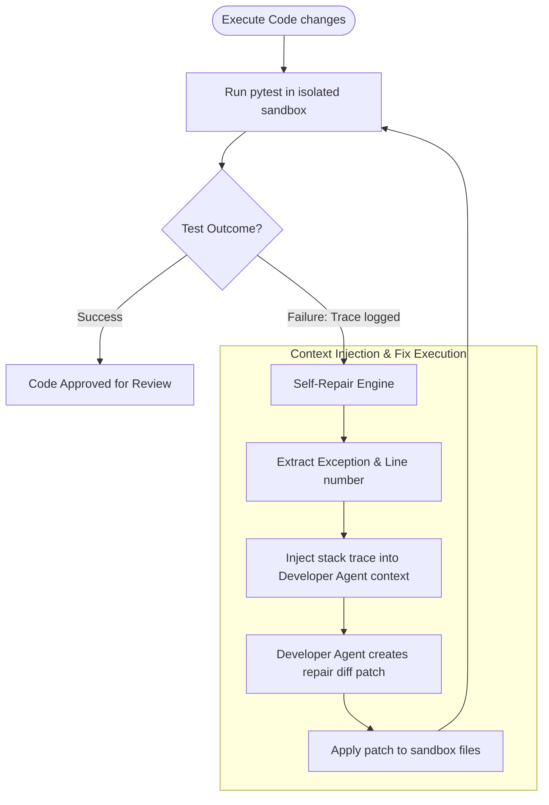

# CodeOrbit AI — Closed-Loop Self-Healing Pipeline

This document details the self-repair loop that handles test suite failures during execution.

---

## 🩺 Closed-Loop Self-Repair Sequence

When a sandbox test suite fails, CodeOrbit AI intercepts the stderr logs, compiles stack traces, and passes them back to the developer to self-heal code.

---

## 🛡️ Guardrails

1. **Cycle Limit**: The self-healing loop is capped at a maximum of **3 repair attempts** to prevent infinite loop logic executions and API token exhaustion.
2. **Crash Dump Logging**: If the threshold is exceeded without a successful run, a detailed system crash report is serialized under `crash_reports/` for human review.
3. **AST Protection**: Code repair patches must pass identical AST security boundaries (no system imports or Reflection overrides) before they are written.
