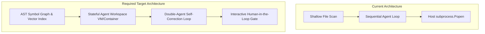
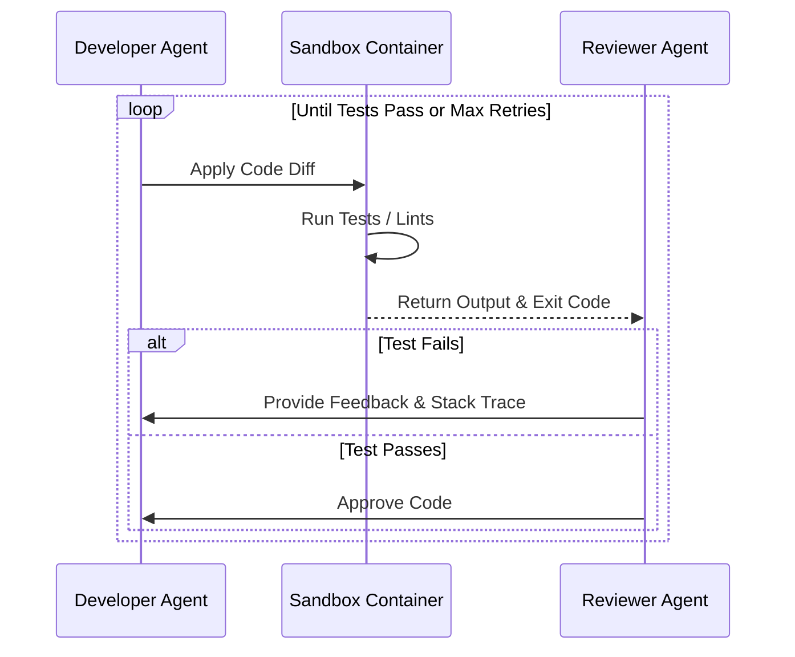

# CodeOrbit AI: Architectural Suitability Analysis

> **Auditor:** CodeOrbit AI AI  
> **Target:** CodeOrbit AI Core Architecture  
> **Reference Document:** CodeOrbit AI Constitution v1.0.0  
> **Verdict:** **Inadequate.** The current architecture does *not* genuinely support an autonomous engineering platform and requires fundamental restructuring.

---

## The Core Verdict: No

Even if all implementation bugs and mock code are ignored, the **current architecture does not genuinely support the creation of an Autonomous AI Software Engineering Platform** as defined in the Constitution. 

The current design is a **sequential task pipeline** mimicking a CI/CD workflow rather than an interactive, repository-aware autonomous agent environment. To compete with systems like Devin, Claude Code, or Cursor, the architecture must transition from a static, linear queue execution model to a dynamic, closed-loop workspace environment.

---

## 5 Architectural Gaps Blocking the Vision



### 1. Lack of a Symbol-Level Repository Indexing Engine
* **The Gap:** The current platform has no concept of repository understanding beyond walking directory trees and checking string patterns in file names. It cannot trace function calls, locate class inheritances, or map import graphs.
* **Why it violates the Constitution:** The Constitution demands "repository understanding." If an agent must edit a function, it cannot know which other files in the codebase depend on that function, leading to cascading runtime failures.
* **Required Architectural Change:** Implement a **Symbol Indexer** that parses the codebase's AST to build a local Dependency Graph (Classes, Functions, Imports) stored in a lightweight Graph DB (e.g. NetworkX/SQLite representation) combined with a local Vector DB containing embeddings of code snippets for semantic retrieval.

---

### 2. Sandbox Isolation: AST Blocklists vs. Virtualized Environments
* **The Gap:** The architecture relies on an AST-based static blocklist running in a host subprocess. 
* **Why it violates the Constitution:** The Constitution specifies "safe execution." In Python, static code analysis is notoriously bypassable. More importantly, running tests or building frontends requires installing dependencies, running compilers, and binding ports, which *cannot* be done safely on the user's host machine.
* **Required Architectural Change:** Implement a **Containerized Sandbox Agent Executor**. Agent tasks must run inside isolated micro-environments (e.g., Docker containers, gVisor, or Firecracker microVMs) with strictly bounded memory, CPU, network policies, and virtual filesystems.

---

### 3. Missing Transactional File System & Workspace Layer
* **The Gap:** The current Developer Agent writes files directly to the host filesystem. If it fails midway or corrupts the syntax, the workspace is left in a broken state.
* **Why it violates the Constitution:** An autonomous agent must be able to explore "branches" of solutions, execute them, and discard them if they fail validation without corrupting the main project directory.
* **Required Architectural Change:** Architect a **Transactional Virtual Workspace Layer** that utilizes Git worktrees, overlay filesystems (like OverlayFS), or in-memory virtual filesystems (VFS) to isolate the agent's edits. The changes should only be merged/written to the main repository after passing the full validation suite and receiving human approval.

---

### 5. Absence of a Self-Correction / Quality Loop
* **The Gap:** The workflow engine executes steps sequentially. If a step fails, execution aborts.
* **Why it violates the Constitution:** Production-ready software development is iterative. If a test fails, a human developer reads the stack trace, modifies the code, and re-runs the test. CodeOrbit AI lacks this capability at the engine level.
* **Required Architectural Change:** Introduce a **Double-Agent Self-Correction Loop** (Developer-Reviewer loop) into the execution engine. If the validation step fails, the traceback and diff must be fed back into the Developer Agent as a new subtask, allowing the agents to auto-debug and self-correct prior to concluding the step.



---

### 5. No Interactive Human-in-the-Loop (HITL) Gate
* **The Gap:** The architecture treats human approval as a post-facto checklist item rather than an interactive operational gate. There is no protocol to pause agent runs, request clarification, accept credentials/secrets, or approve intermediate plans.
* **Why it violates the Constitution:** Real software workflows require collaboration. If the agent needs an API key or is about to execute a destructive schema change, it must pause and request approval.
* **Required Architectural Change:** Refactor the Task Queue and memory states to support a **Suspended/Wait State**. Agents must be able to publish a `WAITING_FOR_HUMAN` status, saving their execution frame, and resuming exactly where they left off once the human responds via the Next.js console.

---

## Architectural Road Map

To align CodeOrbit AI with the Constitution, the following architectural modules must be introduced to replace the current sequential mock engines:

```
+-------------------------------------------------------------------------------+
|                       CodeOrbit AI Core Orchestrator                          |
+-------------------------------------------------------------------------------+
       |                                |                               |
       v                                v                               v
+------------------+           +------------------+           +-----------------+
|  Symbol Indexer  |           | Sandbox Manager  |           | Git Workspace   |
|  & Code Graph DB |           |  (Docker/VMs)    |           |  VFS Manager    |
+------------------+           +------------------+           +-----------------+
```

1. **`CodeIndexer` (Repository Understanding):**
   * Uses tree-sitter or AST parsing to build a mapping of all symbols.
   * Feeds context to agents based on actual symbol call graphs.
2. **`SandboxManager` (Safe Implementation & Validation):**
   * Spawns transient runner containers for executing code and running test commands.
3. **`VFSManager` (Safe Versioning):**
   * Isolates filesystem writes using git-based branches, generating standard Unified Diffs for human review.
4. **`InteractiveEngine` (Human-in-the-Loop):**
   * Manages agent suspension, resuming, and prompt injection mid-run.
