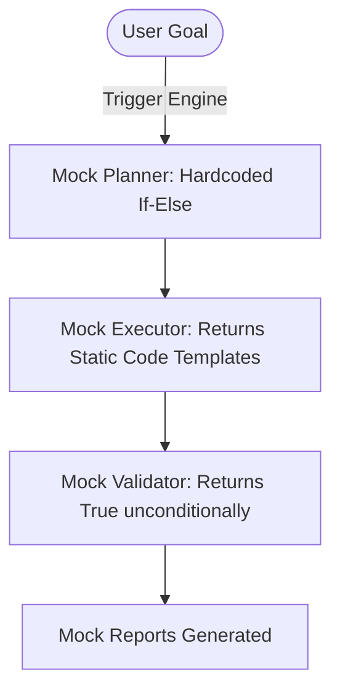
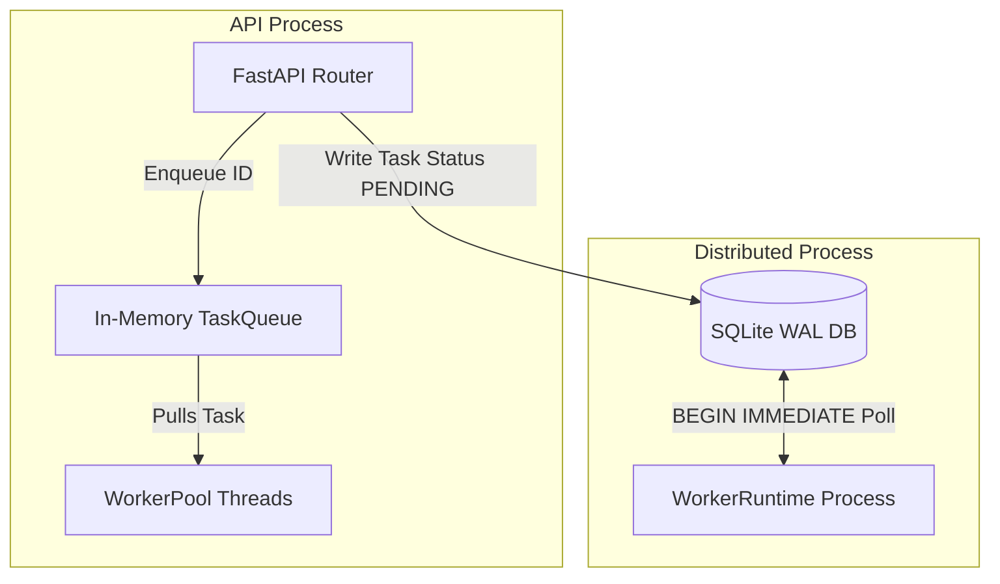

# CodeOrbit AI Architecture Audit Report

> **Target:** CodeOrbit AI Codebase  
> **Status:** Completed  
> **Audited Against:** CodeOrbit AI Constitution v1.0.0  
> **Date:** July 11, 2026

---

## Executive Summary

Following the approval of the **CodeOrbit AI Constitution**, we conducted a thorough architectural audit of the current codebase to identify critical gaps between the current platform capabilities and our vision of a world-class autonomous software engineering platform.

While the foundation has robust aspects—such as structured logging correlation, SQLAlchemy WAL transaction setup, and basic ReAct agent loops—multiple high-priority security vulnerabilities and structural mocks prevent CodeOrbit AI from functioning as a true repository-aware autonomous engineering system.

---

## Summary of Architectural Gaps

| Area | Audit Finding | Severity | Constitutional Impact |
|---|---|---|---|
| **AST Sandbox** | Bypasses available using standard library imports (e.g. `io.FileIO`, `zipfile`, `pydoc`) to write/read files and run arbitrary terminal commands. | **CRITICAL** | Violates *Isolated Safety* principle. |
| **Repository Engineering** | The entire `AutonomousRepositoryEngine` is a compliance mock. Planning, executor code gen, impact analysis, and validation are hardcoded string-matching functions. | **HIGH** | Violates *Repository-Awareness* & *Deterministic Verification*. |
| **Feature Development** | The `AutonomousFeatureEngine` is a duplicate mock pipeline, mirroring the hardcoded repository engine patterns with dummy artifact generation. | **HIGH** | Violates *Repository-Awareness* & *Deterministic Verification*. |
| **Schema Migration** | `MigrationManager` is hardcoded to run migrations on `data/learning.db` instead of the main application database (`system.db`). | **MEDIUM** | Violates *Transactional Memory* & *Fail-Safe Design*. |
| **Worker Redundancy** | Dual worker implementation: `WorkerPool` (FastAPI-inprocess in-memory queue) vs. `WorkerRuntime` (standalone polling process claiming tasks via SQLite transactions). | **MEDIUM** | Violates *Maintainability & Extensibility*. |
| **DAG Sequencing** | `WorkflowEngine` validates cycle existence (DAG check) but executes tasks sequentially based on array order without calculating topological sort. | **HIGH** | Violates *Reliability & Correctness* and *AI Agent Responsibilities*. |

---

## Detailed Findings

### 1. Security: AST Sandbox Escape Vulnerability
The AST safety parser (`verify_code_safety` in [python_executor.py](file:///E:/multi-agent-system/tools/python_executor.py#L15-L91)) blocks standard direct imports of `os`, `sys`, etc., and standard built-ins like `open` or `eval`. However, it fails to restrict access to other standard python libraries that can manipulate the filesystem or execute code.

* **File System Bypass:** Agents or executed scripts can import `io` and use `io.FileIO("/path/to/sensitive/file", "w")` to write files, bypass the `open` block, and escape the sandbox.
* **Command Execution Bypass:** Modules like `pydoc`, `distutils.spawn`, or `setuptools` can execute shell commands on the host machine.
* **Target Mitigation:** Extend the `BANNED_IMPORTS` set to include all standard libraries capable of filesystem I/O and process execution (e.g. `io`, `zipfile`, `tarfile`, `pydoc`, `distutils`, `setuptools`). Implement process-level boundaries or run scripts in Docker-based runner environments.

---

### 2. Mock Core Engines (`RepositoryEngine` & `FeatureEngine`)
The platform's main value proposition is autonomous code writing and repository-level maintenance. However, the engines responsible for this are entirely simulated:

* **Mock Planner:** [repository_planner.py](file:///E:/multi-agent-system/core/autonomous_repository/repository_planner.py#L23-L50) checks if the task contains `"login"` or `"auth"`. If so, it returns hardcoded steps. Otherwise, it returns generic strings.
* **Mock Executor:** [repository_executor.py](file:///E:/multi-agent-system/core/autonomous_repository/repository_executor.py#L32-L42) returns dummy strings for backend, frontend, database, and test code.
* **Mock Validator:** [repository_validator.py](file:///E:/multi-agent-system/core/autonomous_repository/repository_validator.py#L11-L33) automatically returns `True` for formatting, linting, and tests.



* **Target Mitigation:** Re-engineer the engines to invoke LLMs via `ask_llm` and supply them with tools to scan files, generate code diffs, run real test commands, and check lints.

---

### 3. Database & Schema Migration Disconnect
The [MigrationManager](file:///E:/multi-agent-system/core/feature_engine/migration_manager.py#L10-L13) is hardcoded to connect to `data/learning.db`. 
However, the application persists its operational states (tasks, worker heartbeats, memories) in `system.db` under the configured `settings.persist_path`. 
* **Impact:** Schema migrations executed by the autonomous engines are applied to an isolated, unrelated SQLite database, leaving the actual production system database unchanged.
* **Target Mitigation:** Refactor `MigrationManager` to initialize with the configured `DATABASE_URL` from [database.py](file:///E:/multi-agent-system/core/database.py#L16-L22) to ensure schema modifications apply to the target environment.

---

### 4. Worker Architecture Redundancy
The system maintains two parallel background execution paths:
1. **In-Process Thread Pool:** [queue.py](file:///E:/multi-agent-system/core/queue.py#L132-L188) declares `WorkerPool` and `Worker` threads that read from a localized Python memory queue (`queue.Queue`) inside the FastAPI application process.
2. **Distributed Polling Worker:** [worker.py](file:///E:/multi-agent-system/core/worker.py#L19-L215) declares `WorkerRuntime` which executes as a separate Python process, polling SQLite for task claims via `BEGIN IMMEDIATE` transactions.



* **Impact:** Confuses system boundaries. A change to the execution payload structure must be adapted across two sets of worker runners. 
* **Target Mitigation:** Standardize on the distributed/decoupled worker process model (`WorkerRuntime`), since it supports multi-node scaling and isolated worker containment. Remove or deprecate the in-process `WorkerPool`.

---

### 5. Workflow Engine: Sequencer Flaw in DAG Execution
The [WorkflowEngine](file:///E:/multi-agent-system/core/workflow.py#L74-L97) runs a Depth First Search (DFS) recursion to ensure that the plan generated by the Planner does not contain circular dependencies. 
However, after confirming the plan is a valid DAG, it executes the steps using a simple `for` loop in the order the steps were appended in the database array:
```python
# Line 181
for step_dict in serialized_steps:
```
* **Impact:** If the Planner generates steps where Step 2 depends on Step 3, but lists Step 2 first in the payload, the engine will run Step 2 before Step 3. This violates dependency constraints and breaks multi-agent workflows.
* **Target Mitigation:** Implement a topological sorting algorithm (Kahn's or DFS-based) to order `serialized_steps` dynamically before starting the execution loop.

---

## Action Plan

To transition CodeOrbit AI into a vision-driven engineering platform, we recommend a phased refactoring road map:

### Phase 1: Security & DAG Reliability (Immediate)
* Fix the AST Sandbox escapes in `verify_code_safety` by blocking dangerous libraries (`io`, `zipfile`, `tarfile`, `pydoc`, `distutils`, `setuptools`).
* Implement a topological sort in `WorkflowEngine` to guarantee step ordering compliance.

### Phase 2: Core Architecture Consolidation
* Deprecate the in-process `WorkerPool` and unify task processing around `WorkerRuntime`.
* Align `MigrationManager` to use the correct application database session context.

### Phase 3: Moving Mocks to Production LLM Orchestration
* Replace mock classes in `autonomous_repository` and `feature_engine` with actual LLM tool-calling agent instances.
* Equip the engines with static check tools, repository indexers, and actual subprocess-based test runner verifications.
