# CodeOrbit AI: Sprint 3 Deliverables Package

> **Sprint:** 3 (Model Abstraction & AI Orchestration Foundation)  
> **Status:** Completed  
> **Architecture Compliance:** 100% Aligned (v2.2 Frozen)  
> **Test Outcomes:** 122 / 122 Passed (100% Success)  
> **Date:** July 11, 2026

---

## 1. Sprint 3 Report

We have successfully established the foundational orchestration layer that allows multiple LLMs, prompting formats, tools, and roles to interface consistently:

* **Model Provider Layer ([providers.py](file:///E:/multi-agent-system/core/models/providers.py)):** Implements the concrete `GeminiProvider` utilizing the standard `google-genai` client, with retry strategies, timeouts, token tracking, cost tracking, and streaming capabilities. Includes stubs for `OpenAIProvider` and `AnthropicProvider`.
* **Prompt Library ([prompt_library.py](file:///E:/multi-agent-system/core/registry/prompt_library.py)):** Loads versioned markdown prompt files from disk, performs placeholder template formatting (`{{variable}}`), and validates that all template parameters are supplied.
* **Tool Registry ([tool_registry.py](file:///E:/multi-agent-system/core/registry/tool_registry.py)):** Manages role-based tool restrictions, read/write permissions, capability requirements, and tool lookup boundaries.
* **Skill Registry ([skill_registry.py](file:///E:/multi-agent-system/core/registry/skill_registry.py)):** Standardizes procedural markdown documents, parsing YAML frontmatter tags to filter version and categories.
* **Agent Profiles ([profiles.py](file:///E:/multi-agent-system/core/models/profiles.py)):** Instantiates configuration-driven profiles for all 6 agent roles (Planner, Researcher, Developer, Reviewer, Repository Engineer, Product Builder) mapped to [agent_profiles.json](file:///E:/multi-agent-system/core/config/agent_profiles.json).
* **LLM Session Objects ([session.py](file:///E:/multi-agent-system/core/models/session.py)):** Establishes the core data models (`Conversation`, `Message`, `ToolCall`, `ToolResult`, `Usage`, `Cost`, `SessionMetadata`) for inter-agent communication.
* **Refactoring Registry Package:** Refactored legacy `core/registry.py` into a package directory structure with `core/registry/__init__.py` to support clean sub-namespace loading.

---

## 2. Architecture Notes

* **Zero Hardcoded Prompts:** Prompts are stored as individual markdown files under [core/prompts/](file:///E:/multi-agent-system/core/prompts) and loaded dynamically, adhering to repository integrity.
* **Cost Analytics:** Integrates per-token billing lookups dynamically querying `settings.model_pricing` with hook registrations (`on_usage_tracked`).
* **Decoupled DI Registrations:** All registrations are managed in `core/di_setup.py` and boot on app lifespan triggers.

---

## 3. Updated Dependency Graph

The following Mermaid diagram outlines the relationships between Sprint 1 interfaces, Sprint 2 repository crawling, and Sprint 3 orchestration foundations:

```mermaid
graph TD
    classDef sprint1 fill:#f9f,stroke:#333,stroke-width:2px;
    classDef sprint2 fill:#bbf,stroke:#333,stroke-width:2px;
    classDef sprint3 fill:#bfb,stroke:#333,stroke-width:2px;

    DIContainer[core/di.py]
    
    %% Sprint 1 Protocols
    ISandbox[core/sandbox/interface.py]:::sprint1
    IWorkspaceManager[core/workspace/interface.py]:::sprint1
    ICodeIndexer[core/indexer/interface.py]:::sprint1
    IModelProvider[core/models/interface.py]:::sprint1
    IToolRegistry[core/registry/interface.py]:::sprint1
    ISkillRegistry[core/registry/interface.py]:::sprint1
    IPromptLibrary[core/registry/interface.py]:::sprint1
    
    %% Sprint 2 Concrete
    CodeIndexer[core/indexer/code_indexer.py]:::sprint2
    ASTParser[core/indexer/ast_parser.py]:::sprint2
    RepositoryScanner[core/indexer/repository_scanner.py]:::sprint2
    CodeGraphDB[core/indexer/graph_db.py]:::sprint2
    
    %% Sprint 3 Concrete
    GeminiProvider[core/models/providers.py]:::sprint3
    PromptLibrary[core/registry/prompt_library.py]:::sprint3
    ToolRegistry[core/registry/tool_registry.py]:::sprint3
    SkillRegistry[core/registry/skill_registry.py]:::sprint3
    AgentProfileRegistry[core/models/profiles.py]:::sprint3
    ConversationSession[core/models/session.py]:::sprint3
    
    %% Dependencies
    CodeIndexer --> ASTParser
    CodeIndexer --> RepositoryScanner
    CodeIndexer --> CodeGraphDB
    GeminiProvider --> IModelProvider
    PromptLibrary --> IPromptLibrary
    ToolRegistry --> IToolRegistry
    SkillRegistry --> ISkillRegistry
    
    %% DI mappings
    DIContainer --> ICodeIndexer
    DIContainer --> IModelProvider
    DIContainer --> IToolRegistry
    DIContainer --> ISkillRegistry
    DIContainer --> IPromptLibrary
```

---

## 4. Updated Implementation Roadmap

| Sprint | Subsystem Focus | Key Components | Status |
| :--- | :--- | :--- | :--- |
| **Sprint 1** | DI & Subsystem Interfaces | `core/di.py`, Protocols definitions | **Done** |
| **Sprint 2** | Repository Intelligence | `ASTParser`, `CodeIndexer`, `CodeGraphDB`, Scanners | **Done** |
| **Sprint 3** | AI Orchestration & Stubs | `GeminiProvider`, `PromptLibrary`, Registries, Agent Profiles | **Done** |
| **Sprint 4** | Sandbox & Workspace Isolation | Worktree managers, Docker sandbox runner, Session manager | *Planned* |
| **Sprint 5** | Autonomous Agents & Planning | PlanStep top-sort scheduler, Planner agent loop | *Planned* |

---

## 5. Test Report

All **122 tests** run via Pytest passed successfully:
* **sprint1_di**: 3 tests passing.
* **sprint2_indexer**: 6 tests passing.
* **sprint3_orchestration**: 8 tests passing (verifying provider capability records, registry lookups, template validation errors, agent configuration profiles loading, and session serialization).
* **Legacy tests**: 105 tests passing (0 regressions).
