# CodeOrbit AI: Sprint 4 Deliverables Package

> **Sprint:** 4 (Sandbox & Workspace Isolation)  
> **Status:** Completed  
> **Architecture Compliance:** 100% Aligned (v2.2 Frozen)  
> **Test Outcomes:** 126 / 126 Passed (100% Success)  
> **Date:** July 11, 2026

---

## 1. Sprint 4 Report

We have successfully implemented the complete isolated execution and editing infrastructure as defined in `ARCHITECTURE_V2.md`:

* **Git Worktree Workspace Manager ([workspace_manager.py](file:///E:/multi-agent-system/core/workspace/workspace_manager.py)):** Instantiates true transactional workspace isolation. Supports `create_workspace` branching off the parent head, staging modifications (`stage_changes`), unified diff output (`generate_diff`), atomic commits (`commit_and_merge`), and automated cleanups (`destroy_workspace`).
* **Database-Backed Session Tracker ([session_manager.py](file:///E:/multi-agent-system/core/workspace/session_manager.py)):** Tracks active sessions in the database (`workspace_sessions` table) to prevent resource or container leaks across systems restarts.
* **Dual-Mode Sandbox Runner:**
  * `DockerSandbox` ([docker_sandbox.py](file:///E:/multi-agent-system/core/sandbox/docker_sandbox.py)): CLI-based container executor mounting worktree scopes.
  * `LocalProcessSandbox` ([local_sandbox.py](file:///E:/multi-agent-system/core/sandbox/local_sandbox.py)): Localized virtualenv-scoped execution boundary acting as fallback when Docker is unavailable.
  * `SandboxFactory` ([sandbox_factory.py](file:///E:/multi-agent-system/core/sandbox/sandbox_factory.py)): Automatically checks host capabilities to resolve the target `ISandbox` interface instance.
* **DI Registration:** Configured registrations inside [di_setup.py](file:///E:/multi-agent-system/core/di_setup.py) to bind `IWorkspaceManager`, `IWorkspaceSessionManager`, and `sandbox_factory`.

---

## 2. Architecture Notes

* **Git Worktree Transactionality:** Every code modification proposed by agents will run inside distinct Git worktrees. This prevents file collisions and allows clean rollbacks without polluting the master repository.
* **Execution Boundary Fallback:** When Docker is not installed on the developer's system, the engine falls back to `LocalProcessSandbox`, which runs in virtualenv boundaries with execution limits and timeout hooks.

---

## 3. Updated Dependency Graph

Mermaid diagram outlining the completed subsystems up to Sprint 4:

```mermaid
graph TD
    classDef sprint1 fill:#f9f,stroke:#333,stroke-width:2px;
    classDef sprint2 fill:#bbf,stroke:#333,stroke-width:2px;
    classDef sprint3 fill:#bfb,stroke:#333,stroke-width:2px;
    classDef sprint4 fill:#fbb,stroke:#333,stroke-width:2px;

    DIContainer[core/di.py]
    
    %% Protocols
    IWorkspaceManager[core/workspace/interface.py]:::sprint1
    IWorkspaceSessionManager[core/workspace/interface.py]:::sprint1
    ISandbox[core/sandbox/interface.py]:::sprint1
    
    %% Sprint 4 Concrete
    WorkspaceManager[core/workspace/workspace_manager.py]:::sprint4
    WorkspaceSessionManager[core/workspace/session_manager.py]:::sprint4
    SandboxFactory[core/sandbox/sandbox_factory.py]:::sprint4
    DockerSandbox[core/sandbox/docker_sandbox.py]:::sprint4
    LocalProcessSandbox[core/sandbox/local_sandbox.py]:::sprint4
    DBSessionState[core/workspace/session_manager.py]:::sprint4
    
    %% Mappings
    WorkspaceManager --> IWorkspaceManager
    WorkspaceSessionManager --> IWorkspaceSessionManager
    WorkspaceSessionManager --> WorkspaceManager
    WorkspaceSessionManager --> DBSessionState
    SandboxFactory --> ISandbox
    DockerSandbox --> ISandbox
    LocalProcessSandbox --> ISandbox
    
    %% DI bindings
    DIContainer --> IWorkspaceManager
    DIContainer --> IWorkspaceSessionManager
    DIContainer --> SandboxFactory
```

---

## 4. Updated Implementation Roadmap

| Sprint | Subsystem Focus | Key Components | Status |
| :--- | :--- | :--- | :--- |
| **Sprint 1** | DI & Subsystem Interfaces | `core/di.py`, Protocols definitions | **Done** |
| **Sprint 2** | Repository Intelligence | `ASTParser`, `CodeIndexer`, `CodeGraphDB`, Scanners | **Done** |
| **Sprint 3** | AI Orchestration & Stubs | `GeminiProvider`, PromptLibrary, Registries, Agent Profiles | **Done** |
| **Sprint 4** | Sandbox & Workspace Isolation | Git worktrees, fallbacks, database sessions | **Done** |
| **Sprint 5** | Autonomous Agents & Planning | PlanStep top-sort scheduler, Planner agent loop | *Planned* |

---

## 5. Test Report

All **126 tests** executed via Pytest passed successfully:
* **sprint1_di**: 3 tests passing.
* **sprint2_indexer**: 6 tests passing.
* **sprint3_orchestration**: 8 tests passing.
* **sprint4_sandbox**: 4 tests passing (verifying transactional Git worktree lifecycle, database session state creation/cleanup, local process sandbox execution outputs, and copy in/out filesystem transfers).
* **Legacy tests**: 105 tests passing (0 regressions).
