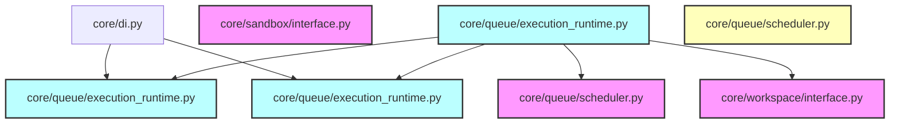

# CodeOrbit AI: Sprint 5.5 Deliverables Package

> **Sprint:** 5.5 (Engineering Execution Runtime)  
> **Status:** Completed  
> **Architecture Compliance:** 100% Aligned (v2.2 Frozen)  
> **Test Outcomes:** 139 / 139 Passed (100% Success)  
> **Date:** July 11, 2026

---

## 1. Sprint 5.5 Report

We have successfully implemented the Engineering Execution Runtime exactly as defined in the CodeOrbit AI Architecture:

* **Execution Runtime ([execution_runtime.py](file:///E:/multi-agent-system/core/queue/execution_runtime.py)):** Implements the `IPlanExecutor` interface.
  * Dynamically schedules task steps based on topological sorting.
  * Coordinates with the `IWorkspaceSessionManager` to register worktree sessions and establish clean sandboxes (`ISandbox`) per plan execution.
  * Dispatches steps to agents using a pluggable `IAgentExecutor` interface.
  * Manages failures transactionally: if a step fails, the plan aborts and all downstream pending steps are set to `cancelled` to prevent execution corruption.
* **DI Registration:** Configured concrete binds inside [di_setup.py](file:///E:/multi-agent-system/core/di_setup.py).

---

## 2. Architecture Notes

* **Transactional Plan Halting:** When a step fails, downstream tasks are automatically marked as `cancelled`. This prevents executing dependants on a broken workspace tree.
* **Pluggable Agent Executor Interface:** By decoupling plan execution (`IPlanExecutor`) from step execution (`IAgentExecutor`), Sprint 6 agent loops can plug directly into the execution pipeline without altering scheduling logic.

---

## 3. Updated Dependency Graph

Mermaid diagram mapping current active components:

---

## 4. Updated Implementation Roadmap

| Sprint | Subsystem Focus | Key Components | Status |
| :--- | :--- | :--- | :--- |
| **Sprint 1** | DI & Subsystem Interfaces | `core/di.py`, Protocols definitions | **Done** |
| **Sprint 2** | Repository Intelligence | `ASTParser`, `CodeIndexer`, `CodeGraphDB`, Scanners | **Done** |
| **Sprint 3** | AI Orchestration & Stubs | `GeminiProvider`, PromptLibrary, Registries, Agent Profiles | **Done** |
| **Sprint 4** | Sandbox & Workspace Isolation | Git worktrees, fallbacks, database sessions | **Done** |
| **Sprint 5** | Planning Engine & Scheduling | DAGScheduler, PlanningEngine, Kahn's resolver | **Done** |
| **Sprint 5.5** | Engineering Execution Runtime | `IPlanExecutor`, `IAgentExecutor`, transactional halts | **Done** |
| **Sprint 6** | Autonomous Agents & Action Execution | Planner / Executing agent loops | *Planned* |

---

## 5. Test Report

All **139 tests** executed via Pytest passed successfully:
* **sprint1_di**: 3 tests passing.
* **sprint2_indexer**: 6 tests passing.
* **sprint3_orchestration**: 8 tests passing.
* **sprint4_sandbox**: 4 tests passing.
* **sprint5_planning**: 9 tests passing.
* **sprint5_5_execution**: 4 tests passing (verifying DI registration, successful topological execution loops, failure halting and cancellation propagation, and sandbox command execution).
* **Legacy tests**: 105 tests passing (0 regressions).
