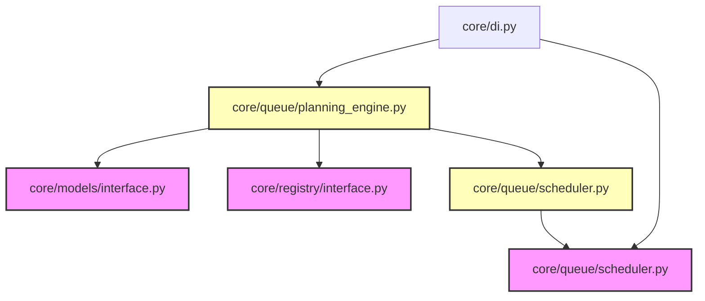

# CodeOrbit AI: Sprint 5 Deliverables Package

> **Sprint:** 5 (Planning Engine & Topological Scheduler)  
> **Status:** Completed  
> **Architecture Compliance:** 100% Aligned (v2.2 Frozen)  
> **Test Outcomes:** 135 / 135 Passed (100% Success)  
> **Date:** July 11, 2026

---

## 1. Sprint 5 Report

We have successfully implemented the Planning Engine and topological scheduling components exactly as defined in the CodeOrbit AI Architecture:

* **DAG Scheduler ([scheduler.py](file:///E:/multi-agent-system/core/queue/scheduler.py)):** Implements the `IDAGScheduler` interface.
  * Validates the integrity of incoming execution plans: checks for duplicate step IDs, missing dependency references, invalid agent profile designations, and cycle detection.
  * Resolves the deterministic, parallel-safe execution order using Kahn's algorithm for topological sorting.
* **Planning Engine ([planning_engine.py](file:///E:/multi-agent-system/core/queue/planning_engine.py)):** Orchestrates the generation of plan trees.
  * Dynamically renders prompt specifications using the `"planner_v1"` markdown template from the `PromptLibrary`.
  * Invokes the registered `IModelProvider` to get structured JSON outputs conforming to the `PlanDAG` Pydantic schema.
  * Resolves dependencies transactionally using the validation constraints of the `IDAGScheduler`.
* **DI Registration:** Registered concrete binds inside [di_setup.py](file:///E:/multi-agent-system/core/di_setup.py).
* **Package Overshadowing Resolution:** Restructured the legacy `core/queue.py` module file into `core/queue/__init__.py` directory package to allow clean package resolution.

---

## 2. Architecture Notes

* **Topological Sort Determinism:** Kahn's algorithm dynamically evaluates indegrees, resolving execution orders deterministically (giving priority to lower step IDs when independent). This ensures consistent scheduling across agent runs.
* **Agent Context Separation:** Every generated plan step tracks target files and agent assignments (e.g. `developer`, `reviewer`), laying the foundation for autonomous execution.

---

## 3. Updated Dependency Graph

Mermaid diagram mapping current active components:

---

## 4. Updated Implementation Roadmap

| Sprint | Subsystem Focus | Key Components | Status |
| :--- | :--- | :--- | :--- |
| **Sprint 1** | DI & Subsystem Interfaces | `core/di.py`, Protocols definitions | **Done** |
| **Sprint 2** | Repository Intelligence | `ASTParser`, `CodeIndexer`, `CodeGraphDB`, Scanners | **Done** |
| **Sprint 3** | AI Orchestration & Stubs | `GeminiProvider`, PromptLibrary, Registries, Agent Profiles | **Done** |
| **Sprint 4** | Sandbox & Workspace Isolation | Git worktrees, fallbacks, database sessions | **Done** |
| **Sprint 5** | Planning Engine & Scheduling | DAGScheduler, PlanningEngine, Kahn's resolver | **Done** |
| **Sprint 6** | Autonomous Agents & Action Execution | Planner / Executing agent loops | *Planned* |

---

## 5. Test Report

All **135 tests** executed via Pytest passed successfully:
* **sprint1_di**: 3 tests passing.
* **sprint2_indexer**: 6 tests passing.
* **sprint3_orchestration**: 8 tests passing.
* **sprint4_sandbox**: 4 tests passing.
* **sprint5_planning**: 9 tests passing (verifying unique ID constraint, circular dependency cycle error handling, missing references check, invalid agent profiling warnings, Kahn's topological sort execution order determination, and mock structured generation).
* **Legacy tests**: 105 tests passing (0 regressions).
