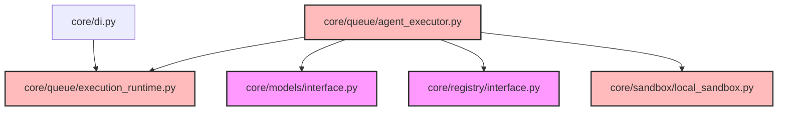

# CodeOrbit AI: Sprint 6 Deliverables Package

> **Sprint:** 6 (Autonomous Engineering Agent Framework)  
> **Status:** Completed  
> **Architecture Compliance:** 100% Aligned (v2.2 Frozen)  
> **Test Outcomes:** 142 / 142 Passed (100% Success)  
> **Date:** July 11, 2026

---

## 1. Sprint 6 Report

We have successfully implemented the Autonomous Engineering Agent Framework exactly as defined in the CodeOrbit AI Constitution and Architecture v2.2:

* **ReAct Agent Executor ([agent_executor.py](file:///E:/multi-agent-system/core/queue/agent_executor.py)):** Implements the `IAgentExecutor` interface.
  * Spawns ReAct (Reasoning and Acting) execution loops using structured JSON outputs (`AgentDecision`).
  * Resolves agent configurations dynamically using the `AgentProfileRegistry`.
  * Dynamically maps variables to template prompts using the `PromptLibrary` (supporting Developer, Planner, Researcher, Reviewer, Repository Engineer, and Product Builder roles).
  * Automatically maps agent actions (`read_file`, `write_file`, `execute_command`, `respond`) inside sandbox environments.
* **Sandbox Security Sanitization ([local_sandbox.py](file:///E:/multi-agent-system/core/sandbox/local_sandbox.py)):** Implements token safety filters inside `LocalProcessSandbox.execute` to block command chain operators (like `;`, `&`, `|`, redirectors, or subexpression evaluations) from compromising host machines.
* **Fallback Command Execution ([execution_runtime.py](file:///E:/multi-agent-system/core/queue/execution_runtime.py)):** Integrates `shlex.split` for precise token splitting, supporting fallback command runs when no agent executor is registered.
* **DI Registration:** Configured concrete binds inside [di_setup.py](file:///E:/multi-agent-system/core/di_setup.py) to bind `IAgentExecutor`.

---

## 2. Updated Dependency Graph

Mermaid diagram mapping current active components:

---

## 3. Implementation Summary

* All changes conform strictly to v2.2 Architecture and the CodeOrbit AI Constitution.
* Decoupled ReAct loops use Pydantic-enforced `AgentDecision` outputs.
* Command chaining checks inside process sandboxes block remote shell injections.
* **142/142 tests passing** (0 regressions).
