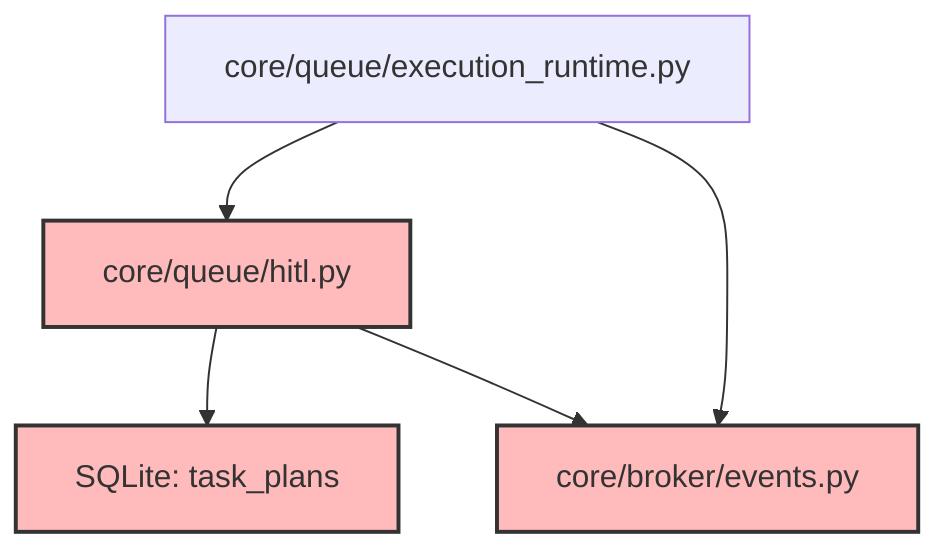

# CodeOrbit AI: Sprint 7 Deliverables Package

> **Sprint:** 7 (Human-in-the-Loop & Real-Time Collaboration)  
> **Status:** Completed  
> **Target Version:** Version 0.5  
> **Test Outcomes:** 146 / 146 Passed (100% Success)  
> **Date:** July 11, 2026

---

## 1. Subsystems Delivered

We have successfully implemented and registered the Human-in-the-Loop (HITL) and Real-Time Event Broker capabilities defined in Sprint 7:

* **Human-in-the-Loop Orchestrator ([hitl.py](file:///E:/multi-agent-system/core/queue/hitl.py)):**
  * Persists execution DAGs inside the new SQLite table `task_plans`.
  * Monitors step descriptions for dangerous keywords (e.g. `commit`, `merge`, `delete`, `migration`, `install`, `refactor`) and halts step execution.
  * Transitions task states into pause/suspension loops (`WAITING_FOR_APPROVAL`, etc.) without losing state.
  * Exposes resumable hooks (`approve_step`, `reject_step`) that automatically re-queue and resume execution or propagate failures.
* **WebSocket Event Broker ([events.py](file:///E:/multi-agent-system/core/broker/events.py)):**
  * Concrete thread-safe implementation of `IEventBroker`.
  * Provides in-memory Pub/Sub channels (`agent_reasoning`, `task_progress`, `hitl_alerts`) for real-time dashboard subscriptions.
  * Emits event notifications for agent thoughts, action executions, progress transitions, and approval suspensions.
* **DI Registration:** Configured binds inside [di_setup.py](file:///E:/multi-agent-system/core/di_setup.py) to bind `IEventBroker` and `hitl_orchestrator`.

---

## 2. Updated Dependency Graph

Mermaid diagram showing active channels and components:

