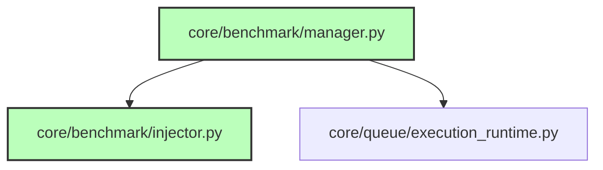

# CodeOrbit AI: Sprint 8.5 Deliverables Package

> **Sprint:** 8.5 (Capability Benchmark Framework)  
> **Status:** Completed  
> **Target Version:** Version 0.6  
> **Test Outcomes:** 159 / 159 Passed (100% Success)  
> **Date:** July 11, 2026

---

## 1. Subsystems Delivered

We have successfully implemented and registered the Capability Benchmark Framework defined in Sprint 8.5:

* **Benchmark Manager ([manager.py](file:///E:/multi-agent-system/core/benchmark/manager.py)):**
  * Concrete implementation of `IBenchmarkManager`.
  * Orchestrates E2E execution runs: spins up isolated workspaces, templates default projects, invokes the failure injection engine, triggers plan runners, and collects metrics/scores.
  * Exports structured JSON scores for API/dashboard support.
* **Failure Injection Engine ([injector.py](file:///E:/multi-agent-system/core/benchmark/injector.py)):**
  * Detemininistic bug substitution engine replacing target snippet lines with buggy syntax or import stubs, and reversing changes safely.
* **Benchmark Reports:**
  * Generates versioned markdown reports inside `docs/` and `docs/reports/`:
    * [BENCHMARK_SUITE.md](file:///E:/multi-agent-system/docs/BENCHMARK_SUITE.md): Catalogs all discovered projects and injectable bugs.
    * [benchmark_results.md](file:///E:/multi-agent-system/docs/reports/benchmark_results.md): Tracks timestamped test durations and execution metrics.
    * [benchmark_scorecard.md](file:///E:/multi-agent-system/docs/reports/benchmark_scorecard.md): Maps capability percentages (Repository Intelligence, Planning, Self-Healing, etc.).
    * [benchmark_history.md](file:///E:/multi-agent-system/docs/reports/benchmark_history.md): Appends a chronological run log.
* **DI Registration:** Configured binds inside [di_setup.py](file:///E:/multi-agent-system/core/di_setup.py) to bind `IBenchmarkManager`.

---

## 2. Updated Dependency Graph

Mermaid diagram showing active components:

