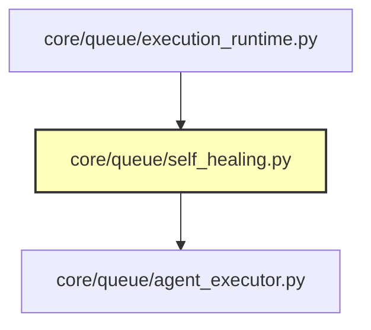

# CodeOrbit AI: Sprint 8 Deliverables Package

> **Sprint:** 8 (Self-Healing Engineering)  
> **Status:** Completed  
> **Target Version:** Version 0.6  
> **Test Outcomes:** 155 / 155 Passed (100% Success)  
> **Date:** July 11, 2026

---

## 1. Subsystems Delivered

We have successfully implemented and registered the Self-Healing Engineering capability defined in Sprint 8:

* **Self-Healing Engine ([self_healing.py](file:///E:/multi-agent-system/core/queue/self_healing.py)):**
  * Concrete implementation of `ISelfHealingEngine`.
  * Orchestrates E2E code repair iterations, matching traceback patterns, classifying categories, extracting file/line metrics, and invoking target agent scripts.
  * Validates modifications inside sandboxes running Ruff lint and Pytest unit check validations.
  * Enforces the 3-attempt hard loop cap to mitigate infinite token usage.
  * Asserts safety constraints, preventing modifications to tests or deletions of production code files.
* **Traceback and Log Parsers:**
  * Regex parsers for Python Traceback traceback errors, Ruff warnings, Pytest assertions, ESLint errors, and TypeScript Compiler errors.
* **Execution Integration ([execution_runtime.py](file:///E:/multi-agent-system/core/queue/execution_runtime.py)):**
  * Invokes the Self-Healing Engine upon step validation failures before cancelling downstream execution steps, increasing E2E pipeline stability.
* **DI Registration:** Configured binds inside [di_setup.py](file:///E:/multi-agent-system/core/di_setup.py) to bind `self_healing_engine`.

---

## 2. Updated Dependency Graph

Mermaid diagram showing active components:

