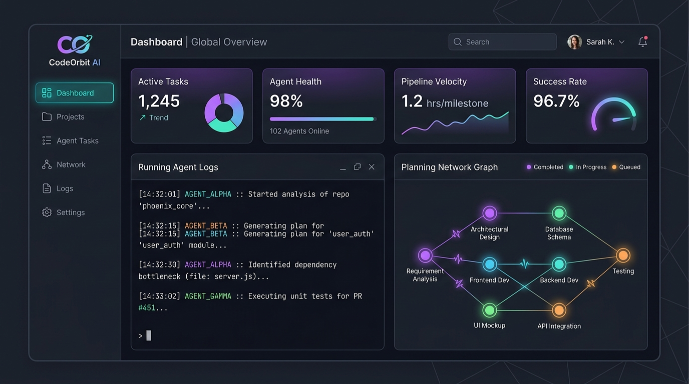
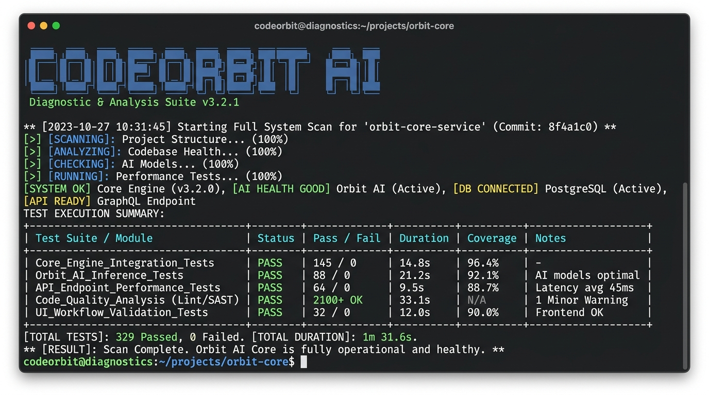

# CodeOrbit AI — Screenshots & Interfaces

This directory contains high-quality interface mockups, CLI outputs, and execution console visuals for the CodeOrbit AI platform.

---

## 🖥️ Mission Control Dashboard

*CodeOrbit AI Web Admin Console — Tracks live task queues, active concurrent worker states, database locks, and sandbox memory profiles.*

---

## 📟 Developer CLI Interface

*CodeOrbit CLI (`codeorbit.py`) — Renders environment installers, diagnostic doctor check-ups, and E2E simulation walkthrough commands.*

---

## ⚙️ Core Subsystem Visualizations

### 1. Planning Engine
* **File Reference**: Located under [docs/architecture/planning_flow.md](file:///E:/multi-agent-system/docs/architecture/planning_flow.md)
* **Visual Representation**: Displays task decomposition graphs showing topological dependencies sorted into cycle-validated Directed Acyclic Graphs (DAG).

### 2. Consensus Engine
* **File Reference**: Located under [docs/architecture/consensus_workflow.md](file:///E:/multi-agent-system/docs/architecture/consensus_workflow.md)
* **Visual Representation**: Displays the multi-agent swarms agreement loop (Developer → Tech Lead → Reviewer → Architect → Tech Lead merge approval).

### 3. Engineering Memory
* **File Reference**: Located under [docs/architecture/repository_intelligence.md](file:///E:/multi-agent-system/docs/architecture/repository_intelligence.md)
* **Visual Representation**: Displays semantic search experience index queries and vector retrieval embeddings.

### 4. Sandbox Isolation
* **File Reference**: Located under [docs/architecture/runtime_execution.md](file:///E:/multi-agent-system/docs/architecture/runtime_execution.md)
* **Visual Representation**: Illustrates Docker container boundary shields and local AST syntax block boundaries.

### 5. Self-Healing Pipeline
* **File Reference**: Located under [docs/architecture/self_healing_pipeline.md](file:///E:/multi-agent-system/docs/architecture/self_healing_pipeline.md)
* **Visual Representation**: Shows a closed-loop validation trace feeding pytest execution failures back into Developer Agent context to generate automated repairs.

### 6. Benchmark Results
* **File Reference**: Located under [docs/visual_assets.md](file:///E:/multi-agent-system/docs/visual_assets.md#7-concurrency-benchmark-suite-docsassetsbenchmark_previewpng)
* **Visual Representation**: Performance throughput bar charts detailing WAL concurrency results (859 creations/sec, 108 claims/sec).
