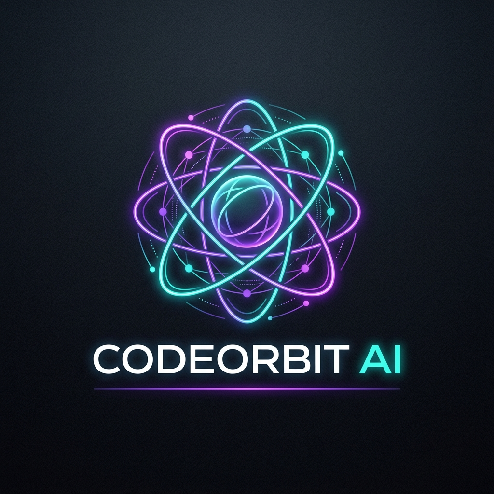
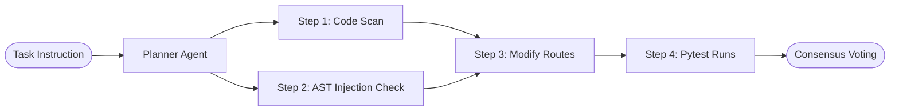
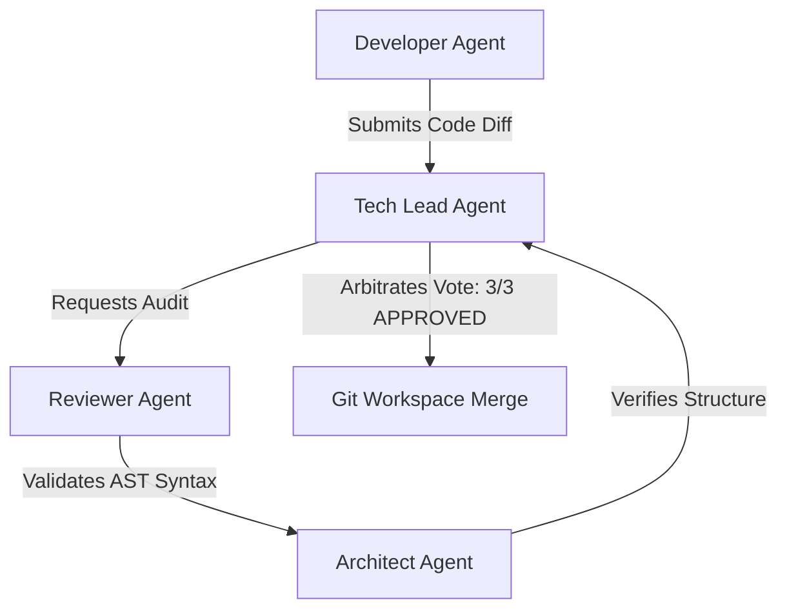
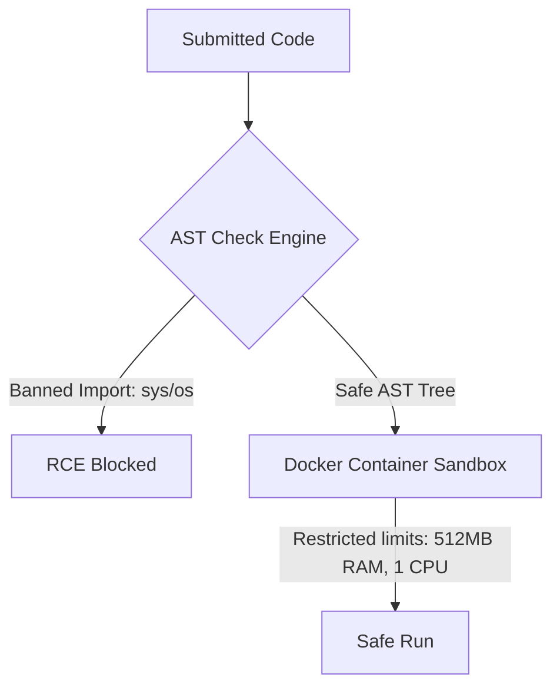
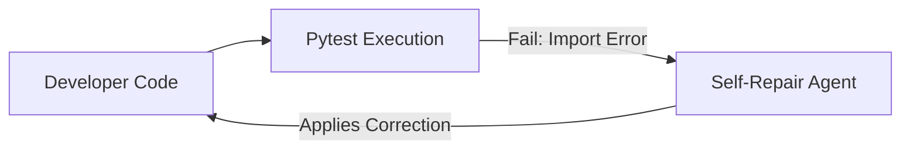

# CodeOrbit AI — Visual Assets Documentation

This document logs the visual assets, branding elements, and screenshot placeholders used across CodeOrbit AI's websites, repositories, and presentation decks.

---

## 🎨 Branding Logo

*CodeOrbit AI Brand Logo — Modern, sleek dark mode aesthetic with orbital tracks illustrating agent coordination.*

---

## 📸 Visual Assets & Layout Mockups

### 1. Developer CLI (`docs/assets/cli_preview.png`)
* **Purpose**: Illustrates the unified CLI execution traces and diagnostics.
* **Layout Design**: A dark carbon-style terminal panel showing output for `python codeorbit.py doctor` and `python codeorbit.py run`.
* **Sub-components**: CP1252-safe ASCII tags, health reports, task logs.

### 2. Mission Control Dashboard (`docs/assets/dashboard_preview.png`)
* **Purpose**: Displays the Next.js Web Admin console.
* **Layout Design**: Three-column dashboard showing the real-time task queue (pending, running, success), CPU/Memory container resources profile charts, and streaming websocket logs.
* **Sub-components**: Worker heartbeats table, execution time latency breakdowns.

### 3. DAG task planner (`docs/assets/planning_preview.png`)
* **Purpose**: Visualizes the Directed Acyclic Graph (DAG) task decomposition.
* **Layout Design**: An interactive network node graph representing task steps sorted topologically.
* **Diagram representation**:

### 4. Consensus Decision Loop (`docs/assets/consensus_preview.png`)
* **Purpose**: Illustrates the multi-agent consensus validation.
* **Layout Design**: A circular debate loop diagram showing reviews and audits.
* **Diagram representation**:

### 5. AST & Docker Container Sandbox (`docs/assets/sandbox_preview.png`)
* **Purpose**: Illustrates local AST parser boundaries and Docker container isolation.
* **Layout Design**: A dual-shield container illustration representing security policies.
* **Diagram representation**:

### 6. Engineering Memory Engine (`docs/assets/memory_preview.png`)
* **Purpose**: Illustrates vector experience retrieval and semantic compaction.
* **Layout Design**: Vector space coordinates mapping cosine-similarity search matches.

### 7. Concurrency Benchmark Suite (`docs/assets/benchmark_preview.png`)
* **Purpose**: Logs high-throughput WAL performance statistics.
* **Layout Design**: Bar charts showing task creations (859/sec) and database claim transaction rates.

### 8. Closed-Loop Self-Healing (`docs/assets/self_healing_preview.png`)
* **Purpose**: Illustrates the error-reflection repair loop.
* **Layout Design**: Flow diagram showing test stack traces fed back into the LLM context.
* **Diagram representation**:

