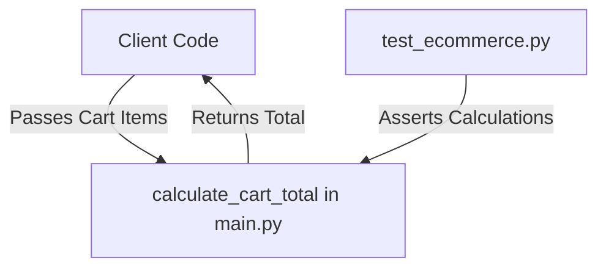

# CodeOrbit AI — E-commerce Example

This example demonstrates a simple e-commerce checkout and discount calculation engine. It serves as a verification target for CodeOrbit AI developer agents to validate automated refactoring, unit test fixing, and code auditing.

---

## 🏗️ Architecture Overview

The example contains a minimal shopping cart computation structure:
1. **Business Logic** (`main.py`): Formulates cart subtotals by scanning price and quantity tuples.
2. **Test Suite** (`test_ecommerce.py`): Performs assertions on calculations.



---

## 🛠️ Getting Started & Commands

### Prerequisites
* Python 3.11+
* Pytest (`pip install pytest`)

### Run the Test Suite
To run the tests locally:
```bash
pytest test_ecommerce.py
```

### Expected Output
```text
============================= test session starts =============================
collected 1 item

test_ecommerce.py .                                                      [100%]
============================== 1 passed in 0.05s ==============================
```

---

## 🤖 CodeOrbit AI Integration & Usage Notes

Developers can orchestrate CodeOrbit AI to perform automated maintenance on this codebase.

### Example Tasks to Run
1. **Apply Discount Rules**:
   ```bash
   python codeorbit.py run "Modify examples/ecommerce/main.py to accept an optional discount percentage parameter and apply it to the final cart subtotal. Update test_ecommerce.py to assert discount application."
   ```
2. **Handle Empty Carts**:
   ```bash
   python codeorbit.py run "Ensure calculate_cart_total in examples/ecommerce/main.py returns 0 when the cart items list is empty or None."
   ```

CodeOrbit AI will automatically initialize a Git worktree, invoke the developer agent, check modifications inside the sandbox, run `pytest`, pass the changes to the reviewer, and merge the approved diff back to the main branch.