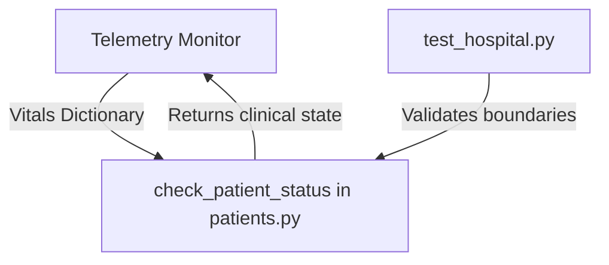

# CodeOrbit AI — Hospital Clinical Status Example

This example simulates a clinical health monitoring utility that reads patient vitals (heart rate, temperature) and assesses the status. It serves as a target project for illustrating automated testing, boundary checks, and bug fixes using CodeOrbit AI.

---

## 🏗️ Architecture Overview

The system consists of:
1. **Core Evaluator** (`patients.py`): Performs conditional checks on blood pressures, pulse, or body temperature.
2. **Clinical Verification** (`test_hospital.py`): Asserts health statuses.



---

## 🛠️ Getting Started & Commands

### Run the Test Suite
To run the clinical checks locally:
```bash
pytest test_hospital.py
```

### Expected Output
```text
============================= test session starts =============================
collected 3 items

test_hospital.py ...                                                     [100%]
============================== 3 passed in 0.04s ==============================
```

---

## 🤖 CodeOrbit AI Integration & Usage Notes

You can orchestrate CodeOrbit AI to write new features or debug status thresholds:

### Example Tasks to Run
1. **Support Oxygen Saturation**:
   ```bash
   python codeorbit.py run "Modify examples/hospital/patients.py to read blood oxygen level 'spO2' from vitals. Return CRITICAL if spO2 < 90, WARNING if spO2 < 95, and STABLE otherwise. Write tests in test_hospital.py."
   ```

CodeOrbit AI will generate a plan, check out a clean Git worktree branch, update code inside AST and Docker boundaries, verify that the pytest runs successfully, and consolidate consensus with code review approvals.