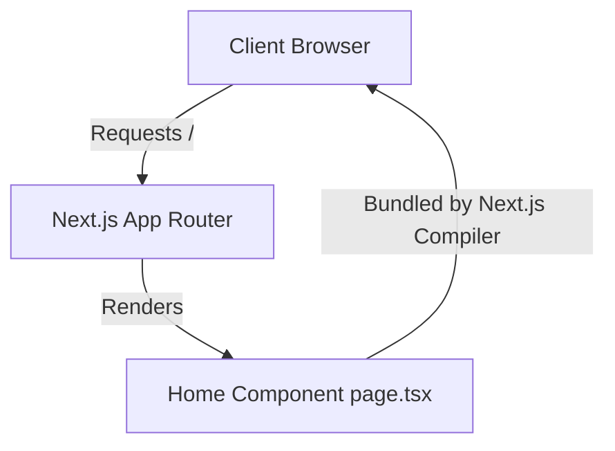

# CodeOrbit AI — Next.js Blog Example

This example represents a frontend React application built on the Next.js 15 App Router framework. It is used to verify CodeOrbit AI's ability to navigate React component hierarchies, update CSS styling tokens, and audit TypeScript configurations.

---

## 🏗️ Architecture Overview

The system structure consists of:
1. **Routing App Router** (`src/app/page.tsx`): Manages the visual layout and content presentation.
2. **Build Configuration** (`package.json` & `tsconfig.json`): Sets compilation boundaries and dependency libraries.



---

## 🛠️ Getting Started & Commands

### Prerequisites
* Node.js 18.0+
* npm 9.0+

### Installation
To install the package dependencies:
```bash
npm install
```

### Start Development Server
To run the Next.js dev server locally:
```bash
npm run dev
```
*The app is served at [http://localhost:3000](http://localhost:3000).*

### Production Build
To test the production compile:
```bash
npm run build
```

---

## 🤖 CodeOrbit AI Integration & Usage Notes

Developers can orchestrate CodeOrbit AI to add pages, adjust styles, or install dependencies:

### Example Tasks to Run
1. **Create Blog Post Page**:
   ```bash
   python codeorbit.py run "Create a new dynamic route examples/nextjs-blog/src/app/posts/[id]/page.tsx that renders a blog post title and body from a mock dataset. Update links in page.tsx."
   ```

CodeOrbit AI will generate a plan, check out a branch, write the React code, run `npm run build` to verify compiling works inside the container sandbox, and merge on success.