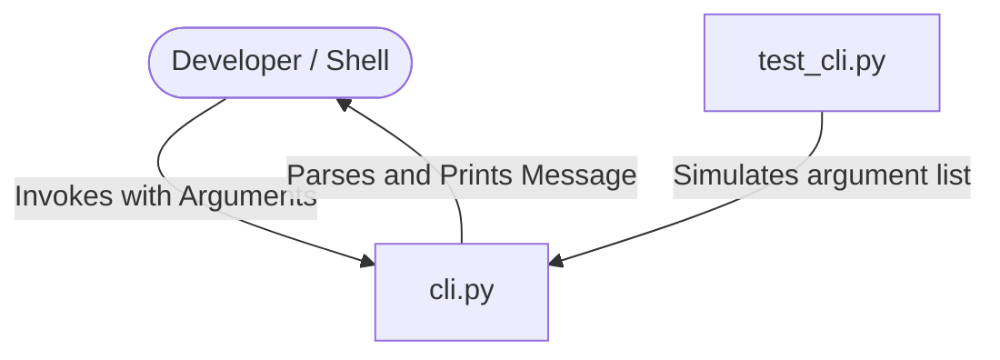

# CodeOrbit AI — Python CLI Example

This example demonstrates a simple command line interface (CLI) application in Python. It serves as a verification workspace for CodeOrbit AI to parse arguments, format text outputs, and run local CLI integration assertions.

---

## 🏗️ Architecture Overview

The system includes:
1. **Command Line Logic** (`cli.py`): Parses standard input arguments using python's native `argparse` library.
2. **Arguments Assertions** (`test_cli.py`): Performs unit testing on parameters and console printing behaviors.



---

## 🛠️ Getting Started & Commands

### Prerequisites
* Python 3.11+
* Pytest (`pip install pytest`)

### Run the CLI Tool
To execute the CLI tool directly:
```bash
python cli.py --message "Testing CodeOrbit AI"
```
*Output:*
```text
Testing CodeOrbit AI
```

### Run the Tests
To execute the test suite:
```bash
pytest test_cli.py
```

---

## 🤖 CodeOrbit AI Integration & Usage Notes

Developers can orchestrate CodeOrbit AI to add subparsers or option hooks:

### Example Tasks to Run
1. **Add Math Operations**:
   ```bash
   python codeorbit.py run "Modify examples/python_cli/cli.py to add an optional numeric subparser argument. Add two numbers and print the sum. Update tests in test_cli.py."
   ```

CodeOrbit AI will generate a plan, check out a branch, modify `cli.py`, run `pytest` inside the local sandbox container, and commit/merge the results.