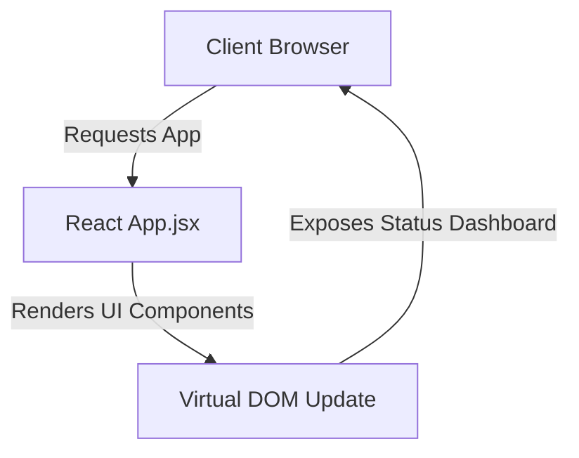

# CodeOrbit AI — React Dashboard Example

This example represents a frontend single page application (SPA) built using React. It serves as a target workspace for verifying CodeOrbit AI's ability to update React components, modify inline styles or CSS layouts, and check JS bundles.

---

## 🏗️ Architecture Overview

The system architecture features:
1. **App View Component** (`src/App.jsx`): Orchestrates dashboard metrics and layouts.
2. **Build Configuration** (`package.json`): Governs module packages and runs the developer server script.



---

## 🛠️ Getting Started & Commands

### Prerequisites
* Node.js 18.0+
* npm 9.0+

### Installation
To install dependencies locally:
```bash
npm install
```

### Start Development Server
To launch the React dashboard application:
```bash
npm start
```
*Access the development build at [http://localhost:3000](http://localhost:3000).*

---

## 🤖 CodeOrbit AI Integration & Usage Notes

Developers can orchestrate CodeOrbit AI to add charts, tables, or buttons to the dashboard layout:

### Example Tasks to Run
1. **Add Metrics Card**:
   ```bash
   python codeorbit.py run "Modify examples/react-dashboard/src/App.jsx to add a metrics grid section displaying CPU usage (45%), Memory (512MB/1GB), and Sandbox status (ONLINE) with beautiful inline CSS styles."
   ```

CodeOrbit AI will generate a plan, check out a branch, modify `App.jsx`, lint the JavaScript, and merge changes on success.